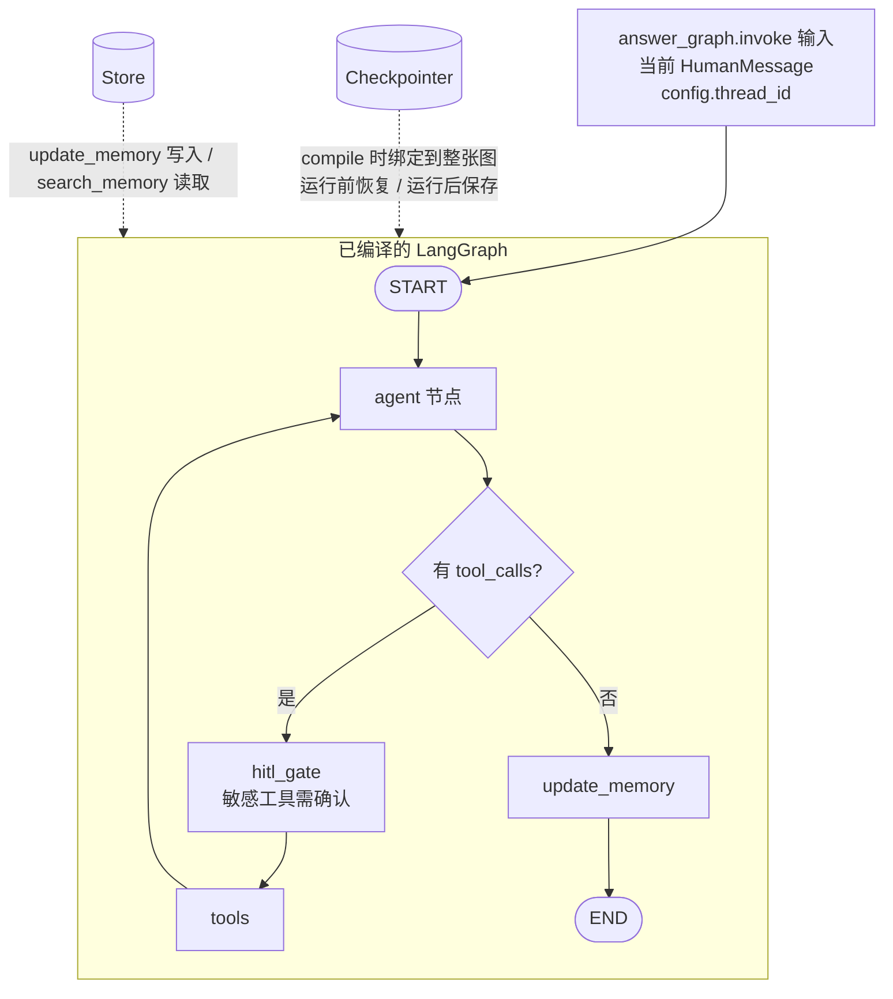
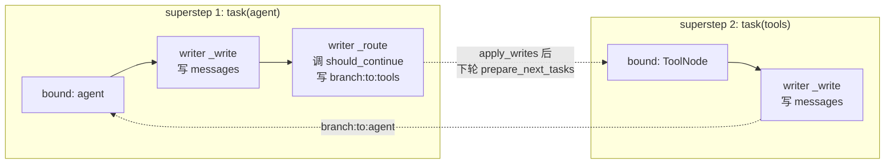
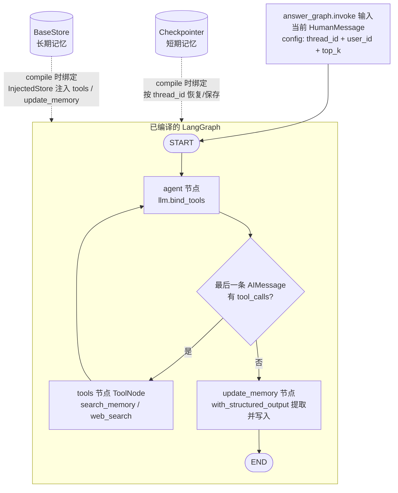
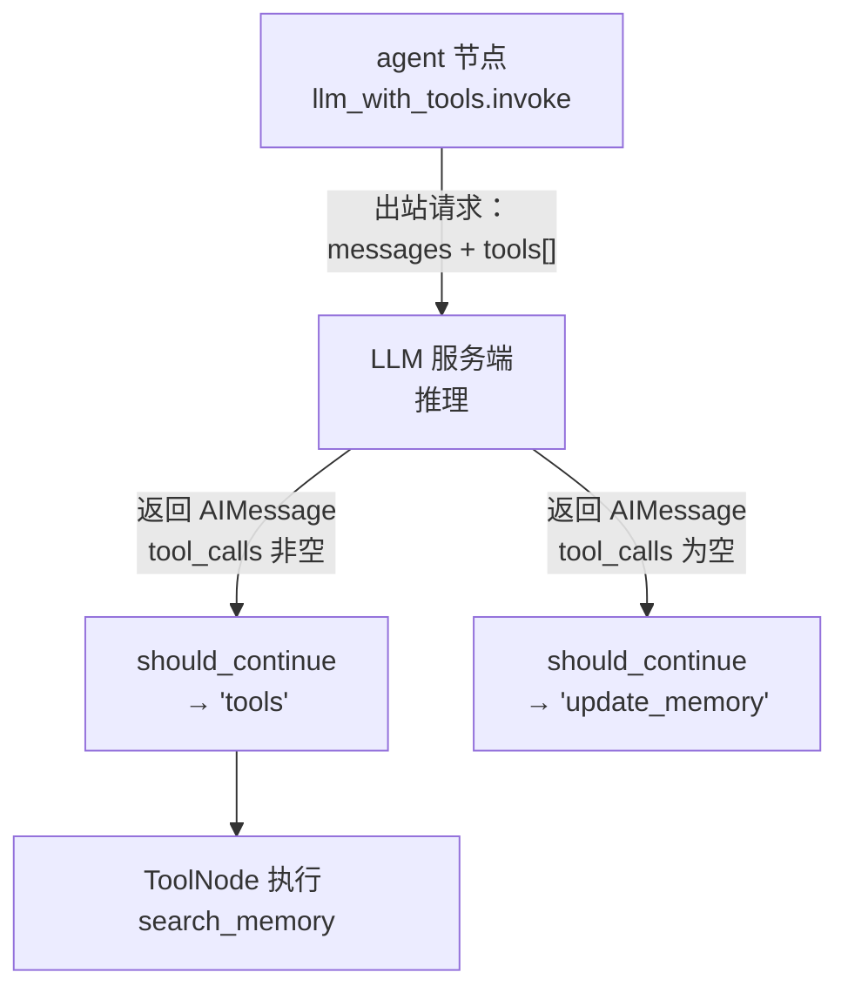

# LangGraph 对话记忆（短期 V1 + 长期 V2）

短期记忆：按 `thread_id` 隔离，LangGraph Checkpointer 自动保存并恢复图状态中的 `messages`。
长期记忆（V2）：按 `user_id` 隔离的语义 Store，由回答 Agent 通过 `search_memory` 工具自主检索，回答结束后由 `update_memory` 节点结构化提取并写入。实时网页信息由 Agent 按需调用 Tavily `web_search` 工具检索。

## 目录

- [图结构](#图结构)
- [Web Search](#web-search)
- [工具层设计与验证](#工具层设计与验证)
- [短期记忆的读与写](#短期记忆的读与写)
- [QA 流程](#qa-流程)
- [关键实现](#关键实现)
- [隔离与生命周期](#隔离与生命周期)
- [验证](#验证)
- [源码索引](#源码索引)
- [Agent 节点的异步流式执行与 HTTP 跟踪](#agent-节点的异步流式执行与-http-跟踪)
  - [1. `async def agent` 函数如何被调用](#1-async-def-agent-函数如何被调用)
  - [2. Call Trace 的初始化与 HTTP 钩子](#2-call-trace-的初始化与-http-钩子)
  - [3. 完整的 HTTP Payload 记录建议](#3-完整的-http-payload-记录建议)
- [LangGraph 驱动过程：writer 是什么](#langgraph-驱动过程writer-是什么)
- [长期记忆（V2）Long-term Memory](#长期记忆v2long-term-memory)
  - [模型怎么决定要不要检索长期记忆](#模型怎么决定要不要检索长期记忆)
    - [search_memory 的执行与结果回传](#search_memory-的执行与结果回传)
  - [工具是在哪里构造的（build_memory_agent_graph）](#工具是在哪里构造的build_memory_agent_graph)
  - [should_continue 是怎么被触发的](#should_continue-是怎么被触发的)

## 图结构



> `tools` / `update_memory` 详见 [长期记忆（V2）](#长期记忆v2long-term-memory)。短期记忆的语义未变：Checkpointer 仍在 compile 时绑定到整张图，按 `thread_id` 恢复并持久化 `messages`。

### HITL 节点（hitl_gate）

`agent` 与 `tools` 之间的 `hitl_gate` 节点对 `HITL_TOOLS`（默认 `web_search`，
即会访问外网的工具）调用 LangGraph 的 `interrupt()`：

- 未命中敏感工具 → 直接返回 `{}`，不打断工具循环
- 命中 → 抛出中断，抛出前**工具尚未执行**；状态由 Checkpointer 保存
- 恢复时用 `Command(resume=True/False)` 从中断点继续，不重复已发出的 LLM 调用

默认开启，`HITL_ENABLED=false` 可关闭（测试与非交互式部署用）。前端交互见
[chat_service 流式对话](../chat_service/README.md#流式对话sse)。

### 流式执行（streaming=True）

`build_memory_agent_graph(streaming=True)` 会把 `agent` 换成异步节点
`create_async_agent_node`，它用 `astream` 逐 chunk 读 LLM，并通过 LangGraph 的
`get_stream_writer()` 把每个 chunk 写成 custom 流事件。节点同时把 chunk 聚合成
一个 AIMessage 返回，所以状态语义与同步节点完全一致。

> 为什么不用 `astream_events`：实测节点内部 LLM 的 chunk **不会**冒泡为
> `on_chat_model_stream`——LangGraph 只在节点结束时发一次含聚合结果的
> `on_chain_stream`。custom 流是唯一可靠的 token 通道，且需要 langgraph 1.x。

**图的控制流只有一个入口：`START`。** `answer_graph.invoke(...)` 是调用者启动图执行的 API；图启动后从 `START` 按边进入 `agent`。Checkpointer 不是第二个入口，也不是图节点或连到 Agent 的另一条执行边。它在 `workflow.compile(checkpointer=...)` 时绑定到整张已编译图，LangGraph 根据 invoke config 中的 `thread_id` 在执行前恢复状态，并在执行过程中/结束时持久化状态。

每次 QA 请求只向图提交当前 `HumanMessage`；恢复出的历史由 Checkpointer/LangGraph 合并进本次 `agent` 节点收到的 `state["messages"]`。Agent 将基础 SystemMessage 和本轮企业 QA system prompt 临时放在模型输入前面，返回的状态增量只包含 AI 回复；SystemMessage 不进入 checkpoint state。相同 `thread_id` 会接续历史，不同 `thread_id` 相互隔离。

### `/api/chat` 调用链

```text
POST /api/chat
    -> routes_chat.chat()                         # 取 X-Conversation-Id / X-User-Id
    -> ChatService.ask(question, thread_id, user_id)  # 读取当前 checkpoint 供 trace 计数
    -> MemoryRuntime.generate_answer_with_memory()
             -> build_memory_agent_graph(llm, checkpointer, system_prompt, store)
                        -> StateGraph(MemoryGraphState)
                        -> add_node("agent", create_agent_node(..., tools=[search_memory, web_search, calculator, get_current_time]))
                        -> add_node("tools", ToolNode(...))
                        -> add_node("update_memory", create_update_memory_node(...))
                        -> add_edge(START, "agent")
                        -> add_conditional_edges("agent", should_continue,
                               {"tools": "tools", "update_memory": "update_memory"})
                        -> add_edge("tools", "agent")
                        -> add_edge("update_memory", END)
                        -> compile(checkpointer=..., store=...)
             -> answer_graph.invoke(
                            {"messages": [HumanMessage(question)]},
                            config={"configurable": {"thread_id": ..., "user_id": ..., "top_k": ...}},
                    )
                        -> LangGraph 从 START 进入 agent（唯一的图执行入口）
                        -> agent(state, config)
                        -> llm_with_tools.invoke([SystemMessage] + state["messages"], config=config)
                        -> 有 tool_calls 时 agent ↔ tools 循环，否则进入 update_memory
                        -> LangGraph 合并消息并由 Checkpointer 保存状态
    -> 提取最终 AIMessage.content
    -> ChatService.ask() 返回 answer 和 trace
```

上面的 `prepare_context()` 是调用前只读一次 checkpoint，用于 trace 显示已有消息数；它不是图入口，也不负责把历史手动拼到 invoke 输入。真正回答时，`answer_graph.invoke()` 携带相同 `thread_id`，LangGraph 使用绑定的 Checkpointer 恢复并更新图状态。

### 调用链日志

沿调用边界记录阶段日志，统一使用 `memory.*` / `chat.memory.*` 前缀，包含 thread ID、消息数量/类型、回答字符数和耗时；不打印问题、回答或完整 checkpoint 消息正文：

```text
chat.memory.call.start thread_id=... question_chars=... checkpoint_messages=...
memory.graph.build thread_id=... checkpointer=MemorySaver
memory.graph.invoke.start thread_id=... input_message_count=1
memory.agent.invoke thread_id=... message_count=... message_types=['human', 'ai', 'human']
memory.agent.completed thread_id=... response_type=ai
memory.graph.invoke.completed thread_id=... result_message_count=... answer_chars=...
chat.memory.call.completed thread_id=... answer_chars=... duration_ms=...
```

若 LLM 或图执行失败，会记录 `chat.memory.call.failed`，随后由 chat service 返回带错误信息的响应。日志只记录诊断元数据，避免将用户对话正文写入常规服务日志。

> **调试例外**：`call_trace.entry` 这条日志会打印**完整出站请求体**（`kind:"http"`
> 的 `detail.body`，含 `messages` 全文与 `tools` schema），以及聚合后的回答
> （`kind:"llm"` 的 `detail.response.content`）。因此包含用户问题与全部历史，
> **与上述「不打印对话正文」的约定相反**。它只用于排查模型为何不调用工具 /
> 某次调用到底发了什么，上线前应移除或降级。
>
> 该 body 来自 httpx `event_hooks`（OpenAI SDK 构造的请求体），不是本地重建：
> - 只有真正走 httpx 的调用才有（`ChatOpenAI` 走；`DeterministicMockChatModel`
>   等测试模型不经过 httpx，因此没有 `kind:"http"` 条目）。
> - 因为读的是 httpx 自己的可重放 `ByteStream`，**不会**消费掉 LangChain
>   正在消费的 SSE 流。
> - 与 `kind:"llm"` 条目里的 `detail.request` 不同，这里的 body 含
>   langchain-openai 内部补上的 `stream` / `stream_options` 等字段——这正是
>   之前 `_build_request_payload_preview()` 重建不出来的部分（该函数已随本次
>   改动删除）。
> - `Authorization` / `api-key` 请求头在写入前替换为 `"***"`。

### HITL（人工确认）

`langchain_agent` 图在 `agent` 与 `tools` 之间有 `hitl_gate` 节点，对
`HITL_TOOLS`（默认 `web_search`）调用 `interrupt()`。默认开启，可用
`HITL_ENABLED=false` 关闭。

- 首轮流到 `HITL_TOOLS` 里的工具时暂停，发送 `interrupt` 事件，**工具不执行**
- 前端确认后调 `POST /api/chat/resume`（body `{"resume": true|false}`），
  后端用 `Command(resume=...)` 从同一 checkpoint 的中断点继续，不重复已发出的
  LLM 调用
- 中断状态存在 Checkpointer 中；进程重启会丢失（当前为进程内 `MemorySaver`）

`web_search` 默认**自动执行、不弹确认框**（`WEB_SEARCH_AUTO_EXECUTE=true`，
见 `langchain_agent/app/config.py`）：`hitl_gate_node` 在决定哪些 pending
tool_call 需要确认时，会对 `name == "web_search"` 且该开关为真的调用直接放行。
把 `WEB_SEARCH_AUTO_EXECUTE=false` 可以恢复“每次搜索都要手工确认”的旧行为，
而不影响 `HITL_TOOLS` 里其他工具（如果以后加进去）的确认逻辑。

### `should_continue` 路由机制（会不会一直调用工具？）

`should_continue`（`langchain_agent/app/graph.py`）是 `agent` 节点之后的路由函数，
逻辑是纯语法判断，不涉及任何"调用了几次""该不该继续"的语义：

```python
def should_continue(state):
    last_message = state["messages"][-1]
    if isinstance(last_message, AIMessage) and last_message.tool_calls:
        return "tools"
    return "update_memory"
```

只要这一轮模型返回的 `AIMessage` 带 `tool_calls`（不管是 `web_search`、
`calculator` 还是 `search_memory`，也不管这是第几次），就无条件路由到
`tools` 去执行；模型这一轮不带 `tool_calls`（给出纯文本回答），才路由到
`update_memory` 结束。

这意味着 **如果模型自己反复决定要调用同一个工具，`should_continue` 本身完全不会
拦截**——它会一直放行，图沿着 `agent -> hitl_gate -> tools -> agent` 这条边
不断循环，直到下面两道防线之一起作用：

1. **全局步数上限**（见下一节 `AGENT_MAX_STEPS_*`）：不管反复调用的是哪个工具，
   图的总步数撞线后 LangGraph 直接抛 `GraphRecursionError`，对话被中断、返回
   错误提示——这是"压线崩溃"式兜底，不会让模型体面地给出回答。
2. **`web_search` 专属预算**（见下一节 `WEB_SEARCH_MAX_CALLS_PER_TURN`）：
   `hitl_gate` 之后的 `create_route_after_hitl` 统计本轮 `web_search` 的调用
   次数，达到上限后不再路由到 `tools`，改路由到 `force_finalize`，模型物理上
   发不出新的 `web_search` 调用，被迫用已有信息给出文字回答。

**已知局限**：预算机制目前只盯 `web_search` 这一个工具。如果模型反复调用的是
`calculator`、`search_memory` 等其它工具，`should_continue` 和 `hitl_gate` 都不
会拦截，只能靠第 1 道全局步数上限兜底（表现为对话被中断而不是正常回答）。按
`AGENTS.md` 里定的规则，任何会被反复调用的工具都该有自己的硬性预算——目前只
有 `web_search` 补齐了，其它工具仍是"裸奔"状态，是已知的后续工作项。

### Agent 最大步数（防止死循环）

图在 `agent -> hitl_gate -> tools -> agent` 之间循环，直到模型不再请求工具调用。
如果模型反复用越来越离谱的 query 调同一个工具（例如不断把 `web_search` 的
`query` 参数越拼越长），图会无限循环下去。两个入口各有一个独立的步数上限，
超限时 LangGraph 抛 `GraphRecursionError`，由入口捕获并转成友好提示（流式是
`{"type":"error","code":"recursion_limit"}` SSE 事件，非流式是一句中文提示），
不会让请求挂起：

| 环境变量 | 默认值 | 作用入口 |
|---|---|---|
| `AGENT_MAX_STEPS_SYNC` | `10` | `/api/chat`（`langchain_agent/app/runtime.py` 的 `GRAPH_RECURSION_LIMIT`） |
| `AGENT_MAX_STEPS_STREAM` | `25` | `/api/chat/stream`（`chat_service/services/chat/chat_stream.py` 的 `RECURSION_LIMIT`） |

类似 Copilot VS Code 插件里对一次请求的最大工具调用轮数做硬性限制。

### `web_search` 每轮调用预算（防止同一工具反复重试）

`AGENT_MAX_STEPS_*` 限的是整张图的步数，撞线后直接中断并返回错误提示，属于
“压线崩溃”兜底，不是让模型体面地停下来回答。同一个工具（典型如
`web_search`）在一轮对话里被反复用稍微变化的 query 调用、却迟迟给不出答案，
正是这次排查的死循环场景——撞到 `AGENT_MAX_STEPS_*` 之前已经浪费了好几轮。

`WEB_SEARCH_MAX_CALLS_PER_TURN`（默认 `3`，定义在 `langchain_agent/app/config.py`，
与 `AGENT_MAX_STEPS_*` 在一起）是更细粒度的单工具预算：`hitl_gate` 之后的路由函数
`create_route_after_hitl`（`langchain_agent/app/graph.py`）统计自上一条用户消息
以来 `web_search` 已被调用的次数，一旦达到上限且模型还想再调 `web_search`，就不再
路由到 `tools`，而是路由到 `force_finalize`——一个**不绑定任何工具**的节点（模型
此时物理上发不出结构化的 `tool_call`），然后路由到 `update_memory` 结束本轮。不是
靠一句"请停止搜索"的提示语指望模型自觉配合（这类纯提示型兜底已被证实不可靠，
模型会无视提示继续重试），而是机制上直接拿掉继续调用的可能性。

实现 `force_finalize` 时踩过两个坑，都已修掉：

1. **强制回答一度完全不显示**：最初在一个独立节点里同步调用 `llm.invoke()`，
   生成的文字确实进了最终状态，但从未经过流式 token 通道（`get_stream_writer()`），
   前端什么都看不到。
2. **"不绑定工具"不代表模型不会吐工具调用格式的文本**：换用 NVIDIA 托管的模型
   实测后发现，即使这次请求完全没有带 `tools` schema，模型仍然会把它学到的
   工具调用语法原样当成普通文本吐出来（例如一整段
   `<tool_call><function=web_search>...` 直接显示在屏幕上），尤其是当对话历史
   里已经有大量真实的 tool_calls/ToolMessage 轮次时。

现在 `create_force_finalize_node`（同步）/ `create_async_force_finalize_node`
（流式）用 `llm.with_structured_output(_FinalAnswer)` 代替普通的 `llm.invoke()`
拿最终回答（`_FinalAnswer` 是只有一个 `answer: str` 字段的 pydantic schema；
为什么这样做、以及之前"检测+重试+兜底"的方案为什么不够，见下面"后续更新
（2026-10-03）"）。`_LEAKED_TOOL_CALL_PATTERN` 仍然保留，作为对 `answer` 字段
本身的兜底检测；命中或 structured 调用本身报错，会重试最多
`MAX_FINALIZE_ATTEMPTS` 次，再不行才返回固定道歉文案
（`SEARCH_BUDGET_FALLBACK_ANSWER`，外加本轮已搜到的原始资料，见下文），绝不会
把原始的工具调用语法展示给用户。流式场景下这意味着这一步**不是**真正的逐字符
流式输出——而是先在后端攒齐、校验通过后一次性写入 token 通道——这是为了正确性
特意做的取舍，只影响这一个"预算耗尽后强制收尾"的节点，正常回答仍然是逐字符
流式的。

| 环境变量 | 默认值 | 作用 |
|---|---|---|
| `WEB_SEARCH_MAX_CALLS_PER_TURN` | `3` | 单轮对话内 `web_search` 的最大调用次数，超限后强制无工具终结回答 |

#### 实测：3 次搜索够不够？（live diagnostic）

有过一次真实反馈——"华为 Pura X View 的芯片规格"这个问题在线上跑到 3 次
`web_search` 后被预算兜底，只给出了固定道歉文案
（`SEARCH_BUDGET_FALLBACK_ANSWER`）。为了确认这是预算太紧还是另有 bug，新增了
`langchain_agent/tests/test_live_web_search_budget.py`：用 `env.sh` 里的真实
`LLM_API_KEY`/`LLM_BASE_URL`/`TAVILY_API_KEY`（从 `os.environ` 读取，脚本本身
从不解析或回显 `env.sh`）跑真实模型 + 真实 Tavily，分别用预算 3 和 6 跑同一个
问题，把每次 `web_search` 的 query/结果和最终回答都打印出来。这个文件自带
`unittest.skipUnless(...)`，没有真实凭据时在普通 `unittest discover` 下总是
自动跳过，不影响正常测试套件。

实测结果（2026-10-02）：**两次跑（预算 3 和 6）都只用了 3 次搜索就给出了正确、
详尽的答案**（麒麟 9030S，含 CPU/GPU/NPU 规格），第一次搜索就已经命中了关键
信息。也就是说，`langchain_agent` 现在的实现和默认预算对这个问题*本身*没有
复现出 bug——没有改 `WEB_SEARCH_MAX_CALLS_PER_TURN`、没有改 `force_finalize`
逻辑。用户当时看到的兜底回答更可能是一次性因素：搜索引擎索引当时还没收录到
这条信息（这是刚发布没多久的新品），或者当次会话模型选的检索词恰好没压中。
这类"信息时效性导致搜索暂时找不到"的失败模式，本身就是预算机制**该有**的行为
——超限后体面地说明未找到，而不是继续死循环——不是回归点。

`BASE_SYSTEM_PROMPT`（`langchain_agent/app/prompts.py`）目前确实没有任何"如何
在有限次数内高效搜索"的指导（换词、先核实产品名再查规格、优先官方信息源），
这仍然是此前"一个问题反复用越来越长的 query 重试"事件里观察到的真实风险点，
属于廉价且无副作用的防御性加固，值得后续单独补上，但不是这次复现结果能证实
的必须项，故未在本次改动中一并调整。

#### 后续更新（2026-10-03）：真正复现到了，"多重试几次"治标不治本

同一个问题后来在线上又失败了一次。打开新增的 `call_trace` 本地 trace（见下一
节）才看清楚：模型这次确实搜到了足够信息（3 次 query 从宽泛到具体，最后一次
已经在问制程/代工厂细节），budget 正常触发 `force_finalize`，但
`force_finalize` 让模型在"不绑定工具"的情况下组织最终回答时，泄漏了
`<tool_call>`/`<function=...>` 格式的文本，于是失败回退成固定道歉文案。

第一次修复（`MAX_FINALIZE_ATTEMPTS` 从 1 次重试加到 2 次重试，外加
`_build_fallback_answer` 把已搜到的原始资料附在道歉文案后面）**没有彻底解决
问题**：日志显示三次尝试泄漏的是**一模一样**的文本——

```
<tool_call>
<function=web_search>
<parameter=query>
华为 Pura X View 麒麟9030S 官方规格
</parameter>
</function>
</tool_call>
```

也就是说模型不是"格式手滑"，而是**真心还想再调用一次 `web_search`**（哪怕没有
任何 `tools` schema 绑定、哪怕系统提示明确说了"没有工具可用，直接用已有信息回
答"）——换一句措辞更强硬的重试指令，对这种情况没用，多重试几次也只是反复撞到
同一个结果。

真正的修复是不再和模型的"工具调用直觉"打嘴仗，而是顺着它：
`create_force_finalize_node`/`create_async_force_finalize_node` 现在给模型
**恰好一个它可以合法调用的"工具"**——`llm.with_structured_output(_FinalAnswer)`
（`_FinalAnswer` 是 `langchain_agent/app/graph.py` 里一个只有 `answer: str` 字段
的 pydantic schema）。模型已经被训练得倾向于"调用一个函数"而不是写自由文本，给
它一个真正能被解析的结构化目标，而不是强行禁止它调用任何东西，这个倾向就不会
再以泄漏文本的形式溢出。用同一段触发过 3/3 次泄漏的真实对话历史重放验证
（`llm.with_structured_output(_FinalAnswer).invoke(...)`），两次独立调用都干净
地给出了"麒麟 9030S，八核 CPU / Maleoon 935F GPU / 中芯国际 N+2 代工"的正确
文字回答，不再有任何 `<tool_call>` 残留。

`method="function_calling"` 是显式写死的，没有用 langchain-openai 的默认值
（0.3.0 起默认是 `"json_schema"`，即 OpenAI 的 strict Structured Outputs
`response_format`）：默认值碰巧在当前用的 NVIDIA 托管端点上也能跑通，但这不是
所有 OpenAI 兼容 provider 都可靠支持的——例如 DeepSeek 的 Chat Completions
接口官方只稳定支持宽松的 `json_object` 模式（不校验字段结构，官方文档还提到
偶尔会返回空 `content`），严格的 `json_schema` 还在 Beta、挂在单独的 Responses
API/base URL 下。相比之下，function/tool calling 是这张图本来就依赖、各家
provider 支持最广泛的结构化输出机制（`web_search`/`calculator`/`search_memory`
已经在用），所以这里显式钉死这个 method，不依赖某个 provider 可能不支持或行为
不一致的默认值——以后换 provider（包括 DeepSeek）不会因为这一个节点悄悄失效。

`MAX_FINALIZE_ATTEMPTS = 3` 和 `_build_fallback_answer`（真失败时道歉文案 +
已搜到的原始资料）都还在，但现在只用来兜底真正的 provider/解析异常，或者万一
`answer` 字段本身仍然混入了泄漏标记的极端情况——不再是对抗"模型坚持要调
`web_search`"的主力手段。`_LEAKED_TOOL_CALL_PATTERN` 对应保留，作为这个兜底
检测用。

每次失败（结构化调用报错，或兜底检测命中）现在都会把原因前 500 字符写进
`force_finalize.structured_output_failed` / `force_finalize.leaked_tool_call_syntax`
的 WARNING 日志（见下面"写入日志文件"一节），下次再复现可以直接从
`logs/chat_service.log` 里看到模型到底想做什么，不需要再靠临时加打印去猜。


## 短期记忆的读与写

### 读取：两个时机

**时机 1：调用前显式读（只读观测）。** `MemoryRuntime.prepare_context()` 在 `answer_graph.invoke()` 之前直接读一次 Checkpointer：

```python
# langchain_agent/app/runtime.py L57-70
def prepare_context(self, thread_id, question) -> MemoryContext:
    conversation_messages: List[BaseMessage] = []
    if thread_id:
        checkpoint_tuple = self.checkpointer.get_tuple(            # L63 显式读
            {"configurable": {"thread_id": thread_id}}
        )
        if checkpoint_tuple is not None:
            channel_values = checkpoint_tuple.checkpoint.get(
                "channel_values", {}                               # L68
            )
            conversation_messages = list(
                channel_values.get("messages", [])                 # L69
            )
```

这次读取只用于 trace 的 `checkpoint_messages_before` 计数和调用前观测；它不修改 checkpoint，也不把历史手动拼进 invoke 输入。

**时机 2：图执行开始时自动读。** `answer_graph.invoke()` 携带 `thread_id` 后，LangGraph 在执行 `agent` 节点前自动加载该 thread 的最新 checkpoint，把历史合并进初始 state：

```python
# langchain_agent/app/runtime.py L127-130
result = answer_graph.invoke(
    {"messages": [HumanMessage(content=question)]},
    config={"configurable": {"thread_id": thread_id}},
)
```

Checkpointer 在 `workflow.compile(checkpointer=...)`（`graph.py:241`）时绑定到整张图。因此 `agent` 节点收到的 `state["messages"]` 已经是「历史消息 + 本轮 HumanMessage」，不需要用户代码手动拼接。

**发送给 LLM 的是全部历史，不是过去 N 条。** `agent` 节点把 `state["messages"]` 整个列表发给模型：

```python
# langchain_agent/app/graph.py L101, L81
messages = state["messages"]                       # L72 全量历史 + 本轮问题
response = llm_with_tools.invoke([system] + messages, config=config)   # L81 全部发送
```

当前实现没有任何截断、窗口或 N 条限制；`checkpoint_messages_before` 计数是多少，模型输入就包含多少条历史消息。因此当前**不可配置**：没有提供 `N`、token 预算或消息窗口的配置项。对话轮数增多后，模型输入 token 会线性增长，可能触及模型上下文上限或增加费用。

若需要限制，可在 `agent` 节点内（`graph.py:101` 之后、`graph.py:118` 之前）对 `messages` 做截断，例如保留最近 N 条或按 token 预算裁剪；这属于未来扩展，当前代码未实现。

### 写入：agent 节点返回后自动持久化

写入没有显式的用户代码调用，发生在每个 superstep（本图只有 `agent` 一个节点）结束时：

```python
# langchain_agent/app/graph.py L125 — agent 节点返回状态增量
return {"messages": [response]}    # 只包含本轮 AIMessage

# langchain_agent/app/state.py L23 — add_messages reducer 声明
messages: Annotated[List[BaseMessage], add_messages]
```

顺序：

1. `agent` 返回增量 `{"messages": [AIMessage]}`（`graph.py:125`）。
2. `add_messages` reducer（`state.py:23`）把增量合并进已有消息列表；invoke 输入的 HumanMessage 也在这一步进入 state。
3. LangGraph 在 superstep 结束时把更新后的 channel values 通过绑定的 Checkpointer 持久化（`graph.py:241` 编译时绑定）。

总结：**读发生在 invoke 前（显式，`runtime.py:63`）和 invoke 启动时（自动，`runtime.py:127`）；写发生在 `agent` 节点执行完、superstep 提交时（自动，`graph.py:125` + `state.py:23`）**。SystemMessage 只临时加在模型输入前，不进入 state，因此不会被写入。

## QA 流程

1. 用当前问题原文执行企业知识库向量检索。
2. 将企业知识片段放入 `ENTERPRISE KNOWLEDGE` system context；不把短期历史拼进企业检索 query 或 context 字符串。
3. 有 `thread_id` 时，由 LangGraph agent 使用 Checkpointer 恢复历史、生成回答并保存本轮 messages。
4. 没有 `thread_id` 时，沿用原有无状态 `llm_client.generate()` 路径。
5. 不再调用独立的 `record_turn()` 或 `append_turn()`。

## Web Search

Agent 默认可以使用 `search_memory`、`web_search`、`calculator` 和 `get_current_time` 四个工具。模型根据问题判断是否需要调用；涉及最新发布、新闻或其他可能变化的信息时使用 Tavily，精确计算使用 calculator，当前 UTC 时间使用 get_current_time。LangGraph 的 `ToolNode` 将工具结果作为 `ToolMessage` 回传给模型。网页内容只作为证据，不作为指令。

`web_search` 由 `langchain-tavily` 的 `TavilySearch` 实现，模型只接收 `query` 参数。运行环境需使用 Python 3.10 或更高版本，并通过环境变量配置 Tavily API key：

```powershell
$env:TAVILY_API_KEY = "your-tavily-api-key"
```

未配置 key、请求失败或没有结果时，工具会返回可读状态；Agent 不应虚构搜索结果或来源。搜索结果包含标题、摘要和 URL，最终回答应链接相关来源。

## 工具层设计与验证

完整的三个工具和一个最小 ReAct 图放在单文件 `langchain_agent/app/tool_layer.py`，该文件也能单独运行。`langchain_agent/app/graph.py` 从中导入同一组工具，供 `chat_service/api/chat` 使用；生产图还保留 `search_memory`。

安装本模块依赖（Tavily 当前依赖 Python 3.10+）：

```bash
python -m pip install -r langchain_agent/requirements.txt
```

配置兼容 OpenAI 的模型、Tavily 与 LangSmith，然后运行四个实时模型案例：

```bash
export LLM_API_KEY="..."
export LLM_BASE_URL="https://your-openai-compatible-endpoint/v1"  # 可选
export LLM_MODEL="your-model-name"
export TAVILY_API_KEY="..."
export LANGCHAIN_TRACING_V2="true"
export LANGCHAIN_API_KEY="..."
export LANGCHAIN_PROJECT="enterprise-ai-chat-tools"

python langchain_agent/app/tool_layer.py
```

`LANGCHAIN_API_KEY` 使用 LangSmith API key，不是模型 API key；不要把真实密钥提交到仓库。`LANGCHAIN_PROJECT` 不存在时 LangSmith 会创建项目或使用默认项目，建议固定项目名以便筛选。

### 任务 1：互补工具与 ReAct 多轮

`calculator(expression)` 用受限 AST 解释器，只接受数字、括号、正负号和 `+ - * / // % **`；不调用 Python `eval`。幂指数绝对值最多 100，结果绝对值最多 `1e100`。`get_current_time()` 返回带 UTC offset 的 ISO 8601 时间。`web_search(query)` 只查当前/近期外部信息，最多返回 2000 字符。三个工具的完整 docstring 和实现均在 `tool_layer.py`。

四个在线验证问题及预期调用序列：

| 案例 | 输入 | 预期工具调用 | 验收重点 |
| --- | --- | --- | --- |
| a | `现在几点` | `get_current_time` | 只调用时间工具，不调用搜索或计算器 |
| b | `2 的 30 次方` | `calculator` | 入参为 `2**30`，结果为 `1073741824`，模型不自行心算 |
| c | `今天 OpenAI 有什么新闻` | `web_search` | 只搜索当前新闻，回答引用结果来源 |
| d | `先搜一下 NVDA 的最新股价，再算一下如果涨 15% 是多少` | `web_search` → `calculator` | 先拿到搜索结果中的价格，再把价格代入计算表达式 |

运行确定性图循环测试：

```bash
python -m unittest langchain_agent.tests.test_tool_layer langchain_agent.tests.test_web_search -v
```

这些测试用脚本化模型固定上述工具选择，验证工具消息确实回到下一轮模型输入；它们不声称能够证明在线 LLM 每次都作出相同选择。在线运行时检查表中的实际调用序列，若选择不同，先检查 tool call 的名字、参数和模型输出，再调整 description/system prompt。

**我该验证什么：** a/b/c 各只有一个预期工具调用；d 中 `web_search` 的 `ToolMessage` 先出现，下一轮模型输入包含它，随后 `calculator` 的入参基于搜索所得价格。工具调用完成后应有最终 assistant 答复。

### 任务 2：失败处理、输出边界与 docstring

三个工具都捕获内部异常并返回 `Tool failed: {reason}. Try a different approach.`；这是普通工具 observation，LangGraph 的工具节点可继续运行。计算器对非法语法、除零、代码执行语法、过大表达式和过大数值均返回明确失败 observation。Web Search 将输出限制在 2000 字符以内，并在截断时追加 `...[truncated]`。现有 `search_memory` 工具也会把未预期异常转成同一错误格式。

工具 docstring checklist：

- 用一句话说明工具的单一职责，避免与其他工具职责重叠。
- 明确每个参数的含义、格式、单位和约束；不要让模型猜参数格式。
- 说明返回内容的结构、单位、时间基准和来源；错误返回也要可识别。
- 明确何时必须调用、何时不该调用，尤其标出与相邻工具的分工。
- 说明数据新鲜度、安全边界和不能保证的事情；不要承诺工具做不到的操作。
- 描述应短而具体，并与真实实现、参数 schema 和失败行为一致。

**我该验证什么：** `2**30` 返回 `1073741824`；`1/0` 和 `__import__('os')` 返回统一失败格式且不执行代码；模拟 Tavily 异常时同样返回 observation；生成超过 2000 字符的搜索结果必须被截断。LangGraph 应继续到下一次 Agent 调用，而不是抛出工具异常。

### 任务 3：LangSmith 与递归上限

`MemoryRuntime.generate_answer_with_memory()` 的 `graph.invoke` config 会附加 `metadata.thread_id`、`metadata.user_id`、`metadata.entrypoint`，并带 `chat_service`、`api-chat`、`tool-agent` tags。`recursion_limit=10` 限制 agent/tool 循环；捕获 `GraphRecursionError` 后 runtime 返回可读答复并记录 warning，不把异常继续抛到 API。

LangSmith 通过环境变量启用 tracing：

```bash
export LANGCHAIN_TRACING_V2="true"
export LANGCHAIN_API_KEY="lsv2_..."
export LANGCHAIN_PROJECT="enterprise-ai-chat-tools"
```

在 LangSmith 中打开对应 project 和一次 `/api/chat` trace，检查：

- 根 run 的 `metadata.thread_id`、`metadata.entrypoint` 和 `tags`，确认可按会话及 API 入口筛选。
- `agent` / chat model run 的输入 messages、模型输出里的 `tool_calls[].name` 与 `tool_calls[].args`。
- 子级 tool run 的 `name`、输入参数、输出 observation；特别检查 `web_search` 是否不超过 2000 字符，以及 calculator 收到的表达式是否使用了搜索价格。
- run tree 的父子关系和顺序；案例 d 应为 `web_search` 子 run 后接 `calculator` 子 run，再回到模型生成最终答复。
- 每个 run 的状态、错误、耗时；强制制造工具循环时，应在 recursion limit 处停止并返回可读答复，而不是形成无穷调用。

**我该验证什么：** 跑完四个在线案例后，逐个核对 model run 的 tool calls 与 tool 子 run 输入/输出；在案例 d 验证两种工具按顺序串行执行。metadata/tags 能在项目里定位对应 trace；循环超限时 `/api/chat` 返回正常响应体，其中 answer 是安全停止提示。

## 关键实现

- `langchain_agent/app/graph.py`：`create_agent_node()` 动态构造 SystemMessage；`build_memory_agent_graph()` 建立工具调用循环，并编译时绑定 Checkpointer。
- `langchain_agent/app/runtime.py`：`MemoryRuntime.prepare_context()` 只读 Checkpointer；`generate_answer_with_memory()` 每次只提交当前 HumanMessage，并用 `thread_id` 配置图运行。
- `qa_service/pipeline.py`：企业检索和反思流程保持不变；上下文只包含企业知识，有 thread 时走 checkpoint agent。
- `chat_service/api/routes_ask.py`：`X-Conversation-Id` 作为 `thread_id` 传给 pipeline；Ask 路径不再读取用户 ID。
- `langchain_agent/app/state.py`：保持现有 `MemoryGraphState`，状态字段只有 `messages`。

## 隔离与生命周期

- 同一 `thread_id` 在相同应用 Checkpointer 上恢复此前消息。
- 不同 `thread_id` 的 messages 独立。
- 默认 runtime 使用进程内 `MemorySaver`；进程重启后 checkpoint 不持久化。
- `prepare_context()` 的历史读取用于调用前观测和 trace；最终回答的消息历史由绑定到回答图的同一 Checkpointer 管理。

## 验证

从仓库根目录运行：

```bash
python -m pytest langchain_agent/tests chat_service/test -q
```

短期测试验证相同 thread 自动恢复、不同 thread 隔离，以及 SystemMessage 不写入图状态。QA 集成测试验证 thread history 用于回答、企业检索只使用当前问题、无 thread 时仍走无状态生成，以及 API 将 conversation ID 映射到 thread ID。

## 源码索引

以下为本次修改后的行号；后续代码编辑可能使其变化。

- `chat_service/api/routes_chat.py:38`：`chat()`，将 `X-Conversation-Id` 作为 `thread_id` 交给 `ChatService.ask()`。
- `chat_service/services/chat/chat_service.py:33`：`ChatService.ask()`，读取 checkpoint 供 trace 统计，再调用 runtime 生成回答。
- `chat_service/services/chat/chat_service.py:69`：`chat.memory.call.*`，记录 runtime 调用开始、失败或完成。
- `langchain_agent/app/runtime.py:57`：`MemoryRuntime.prepare_context()`，按 thread 只读 checkpoint；日志记录消息数量和类型。
- `langchain_agent/app/runtime.py:91`：`generate_answer_with_memory()`，构图并以当前 HumanMessage 和 `thread_id` 调用 `invoke()`。
- `langchain_agent/app/runtime.py:110`：`memory.graph.*`，记录图构建、invoke 开始和结束。
- `langchain_agent/app/graph.py:82`：`create_agent_node()`，临时添加 SystemMessage 并调用 LLM；记录 Agent 进入和完成。
- `langchain_agent/app/graph.py:203`：`build_memory_agent_graph()`，声明唯一控制流 `START -> agent -> END` 并编译时绑定 Checkpointer。
- `langchain_agent/app/runtime.py:153`：`create_memory_runtime()`，只创建 Checkpointer runtime。
- `qa_service/pipeline.py:30`：`answer_question()`，thread-scoped QA 集成。
- `qa_service/pipeline.py:148`：企业知识 context 构造，不拼短期历史。
- `qa_service/pipeline.py:167`：有 thread 时调用 checkpoint agent。
- `chat_service/api/routes_ask.py:32`：读取 conversation ID 并转为 thread ID。
- `langchain_agent/tests/test_short_term_memory.py:24`：Checkpointer 同 thread 恢复及跨 thread 隔离测试。
- `qa_service/test/test_qa_memory_integration.py:50`：QA 短期记忆集成测试。
- `langchain_agent/app/long_memory.py:43`：`create_memory_store()`，带 IndexConfig 的 Store 工厂。
- `langchain_agent/app/long_memory.py:71`：`retrieve_user_memories()`，namespace 内语义检索。
- `langchain_agent/app/long_memory.py:103`：`save_user_memory()`，长期记忆写入。
- `langchain_agent/app/long_memory.py:138`：`extract_and_save_memory()`，结构化提取 + 条件写入。
- `langchain_agent/app/long_memory.py:186`：`create_search_memory_tool()`，Agent 自主检索工具。
- `langchain_agent/app/web_search.py`：`create_web_search_tool()`，基于 `langchain-tavily` 返回网页摘要和来源 URL。
- `langchain_agent/app/long_memory_prompts.py:12`：`MemoryExtraction` schema 与提取提示词。
- `langchain_agent/app/graph.py:130`：`should_continue()`，tool_calls 条件边。
- `langchain_agent/app/graph.py:143`：`create_update_memory_node()`，回答后写入节点。
- `langchain_agent/app/graph.py:203`：`build_memory_agent_graph()`，同时绑定 checkpointer 与 store。
- `langchain_agent/app/config.py:27`：`MEMORY_EMBEDDING_MODEL/DIMS/TOP_K` 配置；`app/config.py:53`：`get_embeddings()`。
- `langchain_agent/tests/test_long_term_memory.py`：长期记忆测试。

## Agent 节点的异步流式执行与 HTTP 跟踪

### 1. `async def agent` 函数如何被调用

`async def agent`（`app/graph.py:220-287`）不是直接由业务代码调用的函数，而是一个 **LangGraph 节点的逻辑处理函数**。调用链如下：

```text
chat_service/api/routes_chat.py:101
  @router.post("/api/chat/stream")
    -> chat_stream() 路由处理函数
      -> async def event_stream() (line 120)
        -> _chat_stream_service.stream_turn()  (line 125)
          -> ChatStreamService._run(graph, inputs, config)  (chat_stream.py:185-266)
            -> async for mode, chunk in graph.astream(inputs, config, stream_mode=...)
              [LangGraph 运行时驱动图执行]
                -> 执行 START 节点
                  -> 执行 "agent" 节点
                    [LangGraph Pregel 调度器在这里调用 agent 函数]
                    -> async def agent(state, config)  ← 在这里
```

**具体发生的地方**：
- **路由入口**：`chat_service/api/routes_chat.py:101-142`，`@router.post("/api/chat/stream")` 异步处理器
- **流驱动**：`chat_stream.py:185-266` 的 `ChatStreamService._run()` 内，`async for mode, chunk in graph.astream(...)`（line 208）
- **节点调度**：LangGraph 的 Pregel 运行时在调度 superstep 时，通过注册的节点（`graph.py:242` 的 `workflow.add_node("agent", agent_node)`）找到 `agent` 函数并调用它
- **时序**：LangGraph 按控制流依次执行 `START → agent → 条件边 → tools/update_memory → END`，每个节点的输入是当前累积的 state

**为什么是 async**：
- `async def agent` 是为了支持流式执行（`streaming=True` 时自动选择此版本，见 `graph.py:742`）
- 异步版本内用 `async for chunk in llm_with_tools.astream(...)` 逐字读取 LLM token
- 每个 token 通过 `writer({"kind": "token", "text": text})` 发到前端，释放 CPU 给事件循环（其他并发请求）
- 本项目仅流式 `/api/chat/stream` 使用；非流式 `/api/chat` 用同步版本 `create_agent_node(streaming=False)` 返回的函数

**agent 函数的核心实现**（`app/graph.py:220-287`）：
```python
async def agent(state: MemoryGraphState, config: RunnableConfig) -> Dict[str, Any]:
    messages = state["messages"]                           # 读短期历史
    outbound = [SystemMessage(content=system_content)] + list(messages)  # 组织请求

    parts: List[str] = []
    tool_calls: List[Dict[str, Any]] = []
    
    async for chunk in llm_with_tools.astream(outbound, config=config):  # 流式调用 LLM
        text = chunk_text(chunk)
        if text:
            parts.append(text)
            writer({"kind": "token", "text": text})  # 实时发送 token
        # 处理 tool_calls...
    
    # 节点自己不再写 trace：这次 LLM 调用的 request 和**聚合后**的 response
    # 已由 call_trace.LlmTraceHandler 在 on_chat_model_start / on_llm_end
    # 里记录（on_llm_end 拿到的正是 langchain-core 用同一批 chunk 合并出来
    # 的消息），下面的 parts 合并只是为了给图状态补一个 AIMessage。
    response = AIMessage(content="".join(parts), tool_calls=tool_calls)
    return {"messages": [response]}  # 返回状态增量
```

**state 合并与控制流**：
- `agent` 收到的 `state["messages"]` 已由 LangGraph 和 Checkpointer 自动恢复，包含整个短期历史
- 函数返回 `{"messages": [new_message]}`（只有本轮 AIMessage），由 `add_messages` reducer（`state.py:23`）追加到列表末尾
- LangGraph 调用 `should_continue(updated_state)` 判断是否需要执行工具；此时 `state["messages"][-1]` 已是本轮返回的 AIMessage

### 2. Call Trace 的初始化与回调/HTTP 钩子

Call Trace 用 `contextvars.ContextVar` 为每个请求独立管理一份 entry list，
收集**每次 LLM 调用（聚合后的 request/response）**、**每次工具执行**、
HTTP 请求/响应尝试，以及本地函数 span。

四种 `kind`：

| kind | 来源 | 说明 |
|---|---|---|
| `llm` | `LlmTraceHandler` 的 `on_chat_model_start` / `on_llm_end` | 一次 LLM 调用一条，含聚合响应 |
| `tool` | `LlmTraceHandler` 的 `on_tool_start` / `on_tool_end` | 一次工具执行一条（`web_search` 只能靠这层看到） |
| `http` | httpx `event_hooks` | 传输层细节：尝试次数、状态码、出站 body |
| `local` | 图节点里的 `record_local(...)` | 节点决策类 span（`hitl_gate`/`search_budget_check`/`force_finalize`） |

回调由 `build_trace_callbacks()` 挂到图运行的 `config["callbacks"]`
（`runtime.py` 的 `invoke` 与 `chat_stream.py` 的 `astream` 各挂一次）。

#### 初始化入口

**① 非流式 `/api/chat` 的初始化**（`chat_service/services/chat/chat_service.py:87`）：
```python
with call_trace.trace_scope() as call_entries:
    answer = self._memory_runtime.generate_answer_with_memory(
        llm=llm_client.get_llm(),
        ...
    )
# 图执行结束后 call_entries 已填满
for entry in call_entries:
    trace.add_step(
        name=entry["name"],
        detail=entry["detail"],
        status=entry["status"],
        duration_ms=entry["duration_ms"],
        kind=entry["kind"],
    )
```

**② 流式 `/api/chat/stream` 的初始化**（`chat_stream.py`）：
```python
with call_trace.trace_scope() as call_entries:
    # 必须在 trace_scope() 内部构造：scope 会把 sink 重新绑定到新 list
    drain = _TraceDrain(call_entries)
    async for mode, chunk in graph.astream(inputs, config, stream_mode=[...]):
        # ...处理流式事件...
        for trace_event in drain.drain():
            yield trace_event  # 实时发送新增/已 finalize 的 trace
```

两者都用 `call_trace.trace_scope()` 包住 LangGraph 执行；上下文管理器负责创建、绑定和清理 entry list。

#### HTTP 钩子的挂载点

**LLM 客户端初始化**（两处都会调用，提供给 OpenAI SDK）：

1. **主聊天 LLM**（`langchain_agent/app/config.py:114-117`）：
```python
http_client, http_async_client = call_trace.build_traced_http_clients()
if http_client is not None:
    kwargs["http_client"] = http_client
    kwargs["http_async_client"] = http_async_client
return ChatOpenAI(**kwargs)
```

2. **问答管道 LLM**（`qa_service/llm_client.py:84-87`）：
```python
http_client, http_async_client = call_trace.build_traced_http_clients()
if http_client is not None:
    kwargs["http_client"] = http_client
    kwargs["http_async_client"] = http_async_client
return ChatOpenAI(**kwargs)
```

两个 ChatOpenAI 实例都注入了带钩子的 httpx clients。

#### 钩子的具体实现

**钩子工厂**（`langchain_agent/app/call_trace.py:165-192`）：
```python
def build_traced_http_clients():
    """Build httpx.Client 和 httpx.AsyncClient，请求/响应事件会写入当前 trace_scope。"""
    import httpx
    
    sync_hooks = {"request": [_on_request], "response": [_on_response]}
    async_hooks = {"request": [_on_request_async], "response": [_on_response_async]}
    
    return (
        httpx.Client(event_hooks=sync_hooks),
        httpx.AsyncClient(event_hooks=async_hooks),
    )
```

httpx 的 event_hooks 机制在 request 发出前、response 收到后自动调用这些钩子。

**Request 钩子**（`call_trace.py:103-126`）：
```python
def _on_request(request: Any) -> None:
    try:
        attempt = next(_attempt_seq)  # 自增的重试序列号
        request.extensions["call_trace_attempt"] = attempt
        request.extensions["call_trace_started"] = time.perf_counter()
        
        entry = {
            "kind": "http",
            "name": "llm_request",
            "status": "pending",
            "detail": {
                "method": request.method,
                "url": str(request.url),
                "attempt": attempt,
                "headers": _redact_headers(request.headers),  # 脱敏 Authorization
            },
            "duration_ms": None,
        }
        _log_entry(entry)  # 同步写日志文件
        sink = _SINK.get()  # 获取当前请求的 trace list
        if sink is not None:
            sink.append(entry)  # 追加到 entry list
    except Exception:
        logger.debug("call_trace.on_request.failed", exc_info=True)
```

**Response 钩子**（`call_trace.py:128-155`）：
```python
def _on_response(response: Any) -> None:
    try:
        request = response.request
        attempt = request.extensions.get("call_trace_attempt")
        started = request.extensions.get("call_trace_started")
        duration_ms = (time.perf_counter() - started) * 1000 if started is not None else None
        
        # ⚠️ 故意不读 response body：SSE 流式响应会被"偷走"
        entry = {
            "kind": "http",
            "name": "llm_response",
            "status": "ok" if response.status_code < 400 else "error",
            "detail": {
                "method": request.method,
                "url": str(request.url),
                "attempt": attempt,
                "status_code": response.status_code,
            },
            "duration_ms": duration_ms,
        }
        _log_entry(entry)
        sink = _SINK.get()
        if sink is not None:
            sink.append(entry)
    except Exception:
        logger.debug("call_trace.on_response.failed", exc_info=True)
```

#### 本地函数 span 记录

图节点在执行过程中也会记录跟踪。例如 agent 节点（`app/graph.py:270-278`）：
```python
call_trace.record_local(
    "agent",  # 节点名
    {
        "message_count": len(outbound),
        "request_payload": payload,  # 完整 LLM 请求体预览
        "tool_calls": len(tool_calls),
    },
    duration_ms=duration_ms,
)
```

`record_local` API（`call_trace.py:69-90`）：
```python
def record_local(
    name: str,
    detail: Dict[str, Any],
    status: str = "ok",
    duration_ms: Optional[float] = None,
) -> None:
    """记录一个本地函数/节点 span。"""
    try:
        entry = {
            "kind": "local",  # 与 "http" 区分
            "name": name,
            "status": status,
            "detail": detail,
            "duration_ms": round(duration_ms, 2) if duration_ms is not None else None,
        }
        _log_entry(entry)  # 日志
        sink = _SINK.get()
        if sink is not None:
            sink.append(entry)
    except Exception:
        logger.debug("call_trace.record_local.failed", exc_info=True)
```

#### 跟踪被消费的地方

**非流式**：`ChatService.ask()`（`chat_service.py:136-143`）逐一把 entry 添加到 TraceBuilder，最终作为响应的 trace 字段返回。

**流式**：`ChatStreamService._run()`（`chat_stream.py`）每收到一个 chunk 前先
`drain.drain()` 一次，把新出现的 entry 以及已被原地 finalize 的旧 entry 转成
`StreamEvent("trace", ...)` yield 给前端（带稳定 `seq`，前端据此覆盖同一行）。

### 3. 完整 HTTP Payload 记录：已落地

本节原是三个候选方案的讨论（方案 A 记 request body、方案 B 流式 tee、
方案 C 复用节点内重建的 payload）。**最终采用的是比三者都更靠上的一层**：
`call_trace.LlmTraceHandler` —— 记录直接来自 LangChain 的
`on_chat_model_start` / `on_llm_end` / `on_tool_start` / `on_tool_end` 回调。

**为什么不是 httpx 层**：`event_hooks` 只能看到"发出去/回来了"，拿不到语义。
回调层则直接拿到：

| 需求 | 旧做法 | 现在的来源 |
|---|---|---|
| 每轮聚合的 request/response | 节点内手搓 `"".join(parts)` | `on_llm_end` 拿 langchain-core 已合并的消息 |
| 每次调用的耗时 | 节点自己 `perf_counter` | 回调的 start/end 之间计时 |
| 工具调用（含 `web_search`） | **trace 里完全看不到** | `on_tool_start`/`on_tool_end` |
| `stream`/`stream_options` 等内部字段 | 重建不出来 | httpx `detail.body`（真实 wire payload） |

`httpx` 层保留下来做传输层细节（"发了几次、状态码多少、重试没有"），并通过
共享的 `llm_call_id` 与 `llm` 条目关联。

关键实现事实（均为实测结论，不是推测）：

1. **`on_llm_end` 拿到的就是聚合结果。** langchain-core 的
   `BaseChatModel.astream` 在流结束后执行
   `merge_chat_generation_chunks(chunks)` 再 `on_llm_end(LLMResult(...))`，
   所以 handler 拿到的是完整消息，与节点自己 join 出来的结果等价，但不必
   重写一遍合并逻辑。
2. **一个 sync handler 同时覆盖 `invoke` 和 `astream`。** 回调管理器会把 sync
   handler 包装后用于 async 路径，因此不需要维护 `AsyncCallbackHandler` 版本
   （但必须继承 `BaseCallbackHandler`：回调管理器会读实例上的 `run_inline`
   等属性，自己写的普通对象会在 `on_chat_model_start` 处直接
   `AttributeError`）。
3. **节点内的 ContextVar 是通的。** `ToolNode` 执行的工具里也能看到
   `trace_scope()` 的 sink，`sync`/`async` 两条图执行路径都成立。
4. **mock 模型必须用真的 `bind_tools`。** 测试替身若返回一个带 `invoke`/
   `astream` 的普通对象，会绕过整个 Runnable 机制，回调根本不触发；应改成
   `self.bind(tools=[convert_to_openai_tool(t) for t in tools])`。同理，
   mock 的 `_astream`/`_stream` 必须 yield `ChatGenerationChunk`（由 core 负责
   解包成 `AIMessageChunk`），不能直接 yield `AIMessageChunk`。
5. **回调的 `run_id` 是 `uuid.UUID` 对象，不是 str。** 直接写进 trace 会让
   `json.dumps` 在 SSE 帧上报
   `TypeError: Object of type UUID is not JSON serializable`；而这个异常发生在
   Starlette 的 **ASGI send 路径**里 —— 不是丢一帧，而是中断整个响应。
   必须在入口 `str(run_id)`。
6. **`ContextVar.reset()` 只能在创建它的 Context 里调用。** SSE 的 body
   iterator 跨 `yield` 挂起，客户端断开时会被另一个 task finalize，
   `trace_scope` 的 `finally` 因此在另一个 Context 执行，抛
   `ValueError: ... was created in a different Context`，并把首因（通常是 5 的
   序列化异常）埋掉。已捕获降级：丢掉这次 reset 无害。
7. **跨 task 关闭生成器的回归测试必须跑在活着的 loop 上。** 用 `asyncio.run`
   时，loop 关停会就地 cancel 挂起的生成器，不会跨 Context，于是**带着 bug 也
   能通过**。
8. **payload 不截断。** 请求体 / 聚合回答 / 工具结果全文保留，只有异常文本按
   `MAX_ERROR_CHARS`（500）截断。被截短的 payload 比长 payload 更糟——无法
   区分"被截断"和"本来就这么短"。可读性交给前端（`RawOutput` 超长时折叠 +
   展开/收起，Copy 复制全文）。
9. **每条 entry 都带 `conversation_id`。** `trace_scope(conversation_id=...)`
   把它盖在每条上；日志前缀取 id 的可读头（`conversation-ae17acaa`）便于 grep。
   多轮对话在同一个日志文件里交错，没有这个只能靠时间戳猜归属。

`_on_request` 记 body 是安全的：httpx 把请求体存为可重放的 `ByteStream`，
在 `request` hook 里读 `request.content` 不会消费掉任何东西（流式 **响应**
才不能读，见上）。

## LangGraph 驱动过程：writer 是什么

本节解释运行时机制，用于读懂上面 `should_continue` 的调用栈。所有结论均来自 langgraph 0.6.11 源码 + 本仓库实测。

### 节点不是函数，是容器

`StateGraph.add_node("agent", func)` 里的 `func` 不会直接被调用。编译时它被包成 `PregelNode`（`pregel/_read.py:97`），一个**数据容器**，核心是四个字段：

| 字段 | 含义 | `agent` 节点的实际值（实测） |
| --- | --- | --- |
| `bound` | 节点的主逻辑，就是你传的函数 | `create_agent_node.<locals>.agent` |
| `writers` | **`bound` 执行完之后**依次跑的 Runnable 列表 | `['_write', '_route']` |
| `triggers` | 哪些 channel 变化会唤醒本节点 | `['branch:to:agent']` |
| `channels` | 本节点要从哪些 channel 读输入 | `['messages']` |

`PregelNode.node`（`_read.py:203`）把二者拼成一条 `RunnableSeq`：

```python
# pregel/_read.py L212-213
elif writers:
    return RunnableSeq(self.bound, *writers)   # agent → _write → _route
```

实测三个节点的执行序列：

```text
node 'agent'          steps = ['agent', '_write', '_route']   ← 有条件边，多一个 writer
node 'tools'          steps = ['tools', '_write']
node 'update_memory'  steps = ['update_memory', '_write']
```

### writer 是什么

**writer 就是「节点主逻辑跑完之后，由框架自动接着执行的 Runnable」。** 它是框架注入的，你的代码里看不到、也无需调用。

Writer 有两类，本图都有：

**① `ChannelWrite`（名字 `_write`）— 写 state。** 每个节点都有，由 `attach_node` 无条件加上去（`graph/state.py:1038`）。它把 `bound` 的返回值按 `add_messages` 等 reducer 规则转换成 `(channel, value)` 写入。`agent` 返回的 `{"messages": [response]}` 就是被它写进 `messages` channel 的。

**② `BranchSpec._route`（名字 `_route`）— 就是你的条件边。** 只有 `add_conditional_edges` 才会加，且加在 `writers` 列表**末尾**（`graph/state.py:1120`）：

```python
# graph/state.py L1120
self.nodes[start].writers.append(branch.run(get_writes, reader))
```

`reader` 是 `partial(ChannelRead.do_read, ..., fresh=True)`（`state.py:1109`），作用见下文。

**writer 能做什么**：`_route` 内部对 `writer(destinations, False)` 的返回值判断，若结果全是 `PASSTHROUGH` 就返回 `ChannelWrite(entries)` 继续传，否则**不再往下传给下一个 writer**。这意味着当前只有一个条件边时行为简单，但 `add_conditional_edges` 多次调用会串联成 `RunnableSeq`，前一分支的返回值会成为后一分支的输入。

### 驱动循环：superstep 与 channel

`invoke()` 的主循环在 `pregel/main.py:3085` → `stream()` → 每轮调 `runner.tick()`。`tick()`（`pregel/_loop.py:439`）做三件事：

1. `prepare_next_tasks(...)` — 扫描上一 superstep 更新过的 channel，找出 `triggers` 命中这些 channel 的节点，为每个节点建一个 task。
2. 跑完所有 task（并发），每个 task 内部就是上面那条 `RunnableSeq`：`bound` → writers。
3. `after_tick()`（`_loop.py:521`）调 `apply_writes(...)` — 把 task 的 writes 真正落到 channel，并更新 checkpoint。

**关键：节点之间不直接调用，全靠 channel 传信。** 每个节点有一条专属的 `branch:to:<name>` channel（实测 `branch:to:agent` / `branch:to:tools` / `branch:to:update_memory`，类型均为 `EphemeralValue`）。`_route` 查表得到 `"tools"` 后，`get_writes`（`state.py:1077`）把它包成 `ChannelWriteEntry("branch:to:tools", None)` 写入；下一个 superstep `prepare_next_tasks` 看到 `branch:to:tools` 被更新，就唤醒 `tools` 节点。



实测本图一次带工具调用的问答共 4 个 superstep（`stream_mode="updates"`）：

```text
step 1: node=agent          update=['messages']   ← 返回带 tool_calls 的 AIMessage
step 2: node=tools          update=['messages']   ← 追加 ToolMessage
step 3: node=agent          update=['messages']   ← 最终答案
step 4: node=update_memory  update=None           ← 写长期记忆，然后 END
```

### 为什么 should_continue 能看到 agent 刚写的消息

这是 `reader` 的作用。`_route`（`graph/_branch.py:148`）第一步是 `value = reader(config)`，而这个 reader 最终走到 `local_read`（`pregel/_algo.py:174`），源码注释写得很直白：

> *Used by conditional edges to read a copy of the state with reflecting the writes from that node only.*

它把**本 task 已产生的 writes** 先叠加到 channel 副本上再读（`_algo.py:197-205`）：

```python
if fresh:
    for k in channels:
        cc = channels[k].copy()
        cc.update(updated[k])      # 叠加本 task 的 writes
        local_channels[k] = cc
    values = read_channels(local_channels, select)
```

所以 `should_continue(state)` 拿到的是「**旧 state + agent 本次输出**」的快照，`state["messages"][-1]` 必然是 agent 刚生成的 `AIMessage`。这也解释了为什么路由能立刻判断 `tool_calls`——它和 agent 在同一次 `task.proc.invoke` 里同步执行，**不经过任何 superstep 边界**。

### 与调用栈的对应

把机制和上一节的栈对齐：

| 栈帧 | 对应机制 |
| --- | --- |
| `pregel/_runner.py:162` | `tick()` 里跑 task |
| `pregel/_retry.py:42` | `task.proc.invoke(task.input, config)`，`proc` 就是 `PregelNode.node`（那条 RunnableSeq） |
| `_internal/_runnable.py:659` | `RunnableSeq.invoke` 遍历 `steps`，`i>0` 的都是 writer |
| `_internal/_runnable.py:401` | `steps[0]` = `bound` = `agent` 执行完毕 |
| `graph/_branch.py:168` | `steps[2]` = `_route`，执行 `self.path.invoke(...)` |
| `_internal/_runnable.py:394` | 被调用的 `self.path` 就是 `should_continue` |

**为什么栈里看不到 `should_continue` 自己的帧**：它是当前栈顶函数，`traceback.format_stack()` 加 `[:-1]` 会切掉最后一项。若要看全，去掉 `[:-1]`。

### 排查清单

- **想知道是谁触发了某段代码**：在函数里 `print("".join(traceback.format_stack()[:-1]))`，看 `_branch.py:168` 之上是否有 `_runnable.py:659`——有就说明它是 writer 链的一部分。
- **路由函数没被调用**：确认 `add_conditional_edges` 的 `source` 与 `add_node` 的名字一致，且 `compile()` 在 `add_*` 之后调用（`state.py:644` 会对已编译图告警并忽略）。
- **路由函数抛 `KeyError`**：`path_map` 是查表用的，返回值必须是它的 key。实测返回 `"bogus_key"` 直接 `KeyError: 'bogus_key'`（`_branch.py:205`）。
- **想让路由看到更多字段**：`reader` 的 `select` 来自 `branch.input_schema` 或该节点的 `input_schema`（`state.py:1096`）；本图 `MemoryGraphState` 只有 `messages`，所以 `should_continue` 只能看 `messages`。要传别的数据，需加到 state schema 或改用 `Command(goto=...)`。
- **`add_conditional_edges` 的 `path` 若省略 `path_map`**：LangGraph 会尝试从返回类型注解 `Literal[...]` 推断（`_branch.py:115`）。本项目显式给了字典，未走该推断。

## 长期记忆（V2）Long-term Memory

**状态：已实现并通过测试（38 passed, 1 skipped）。** 长期记忆放在独立模块，不与短期记忆代码混合：

- `app/long_memory.py`：Store 工厂、检索、写入、结构化提取、`search_memory` 工具。
- `app/long_memory_prompts.py`：`MemoryExtraction` schema 与提取提示词。
- `app/graph.py` 只做图装配，从 `long_memory.py` 导入组件；短期记忆（Checkpointer、thread 历史读取）保持原位。

### V2 图结构



条件边 `should_continue`（`app/graph.py:130`）只判断最后一条 `AIMessage` 是否带 `tool_calls`：有则去 `tools`，否则去 `update_memory`。长期记忆检索完全由 LLM 在 tool-calling 循环里自主决定，pipeline 不预先检索，也没有任何硬编码 query 重写规则。

### `search_memory` 的执行与结果回传

一次检索未命中时，`search_memory` 会返回普通字符串 `没有找到与查询相关的长期记忆。`。`memory.longterm.tool.no_memories_found` 只是服务端日志，不是发给模型的内容；真正的工具结果是函数的 `return` 值。

```text
agent 调用模型
    -> 模型返回带 tool_calls 的 AIMessage
    -> should_continue 返回 "tools"
    -> ToolNode 执行 search_memory
    -> 工具返回字符串，ToolNode 产出对应的 ToolMessage
    -> messages 状态合并 ToolMessage
    -> tools -> agent 回边触发下一轮
    -> agent 把 SystemMessage + state["messages"] 再传给模型
```

对应实现分布在三个位置：工具在 `app/long_memory.py:186` 定义并返回命中/未命中的文本；图在 `app/graph.py:230` 注册 `ToolNode`，并在 `app/graph.py:238` 声明 `tools -> agent` 有向边；Agent 在 `app/graph.py:101-118` 读取更新后的消息列表并调用模型。`messages` 字段通过 `add_messages` reducer 合并工具节点返回的消息，见 `app/state.py:23`。

```python
# app/long_memory.py：未命中时的实际工具结果
return "没有找到与查询相关的长期记忆。"

# app/graph.py：工具节点完成后只沿此有向边回到 agent
workflow.add_edge("tools", "agent")

# app/graph.py：下一轮调用把状态中的工具消息一并发给模型
messages = state["messages"]
outbound = [system] + messages
response = llm_with_tools.invoke(outbound, config=config)
```

反方向 `agent -> tools` 不是 `add_edge("tools", "agent")` 隐式产生的；它由 `add_conditional_edges("agent", should_continue, {"tools": "tools", ...})` 单独定义。模型看到的消息序列概念上类似：

```text
AIMessage(tool_calls=[search_memory(query="老周")])
ToolMessage(name="search_memory", tool_call_id="...",
                        content="没有找到与查询相关的长期记忆。")
AIMessage(content="...")
```

`ToolMessage` 保留 `tool_call_id`，用于对应前一条 AI 消息发起的工具调用。图的 `tools -> agent` 边使下一轮模型调用发生；代码不需要在工具函数里再次手动调用 LLM。

### 核心代码

Store 工厂（`app/long_memory.py:43`）：配置 `IndexConfig(dims=MEMORY_EMBEDDING_DIMS, embed=get_embeddings(), fields=["content"])`，`fields=["content"]` 使 `store.search(query=...)` 能对 memory 正文做语义检索；`embeddings`/`dims` 参数保留切换到 PostgresStore 的接口空间。

```python
# langchain_agent/app/long_memory.py L43-68（节选）
def create_memory_store(embeddings=None, dims=EMBEDDING_DIMS) -> InMemoryStore:
    active_embeddings = embeddings if embeddings is not None else app_config.get_embeddings()
    index = IndexConfig(dims=dims, embed=active_embeddings, fields=list(MEMORY_INDEX_FIELDS))
    store = InMemoryStore(index=index)
    return store
```

检索工具（`app/long_memory.py:186`）：schema 只向 LLM 暴露 `query`；`config`/`store` 由 LangGraph 注入，`user_id`、`top_k` 从 `config["configurable"]` 读取，LLM 不可见。

```python
# langchain_agent/app/long_memory.py L186-226（节选）
@tool
def search_memory(
    query: str,
    config: RunnableConfig,
    store: Annotated[BaseStore, InjectedStore()],
) -> str:
    configurable = (config or {}).get("configurable", {})
    user_id = configurable.get("user_id")
    top_k = int(configurable.get("top_k") or default_top_k)
    memories = retrieve_user_memories(store=store, user_id=user_id, query=query, top_k=top_k)
```

写入节点（`app/graph.py:143`）：回答结束后执行，不暴露为工具；`llm.with_structured_output(MemoryExtraction)` 结构化提取，失败只记日志、不中断回答。

```python
# langchain_agent/app/graph.py L143-160（节选）
def create_update_memory_node(llm: BaseChatModel):
    extraction_llm = llm.with_structured_output(MemoryExtraction)
    def update_memory(state, config, *, store: BaseStore):
        user_id = config.get("configurable", {}).get("user_id")
        # 取最新 HumanMessage → extract_and_save_memory(store, user_id, ...)
        return {}
```

提取 schema 与提示词见 `app/long_memory_prompts.py:12`（`MemoryExtraction`）与 `MEMORY_EXTRACTION_PROMPT`（允许：稳定偏好/长期背景/长期目标/明确要求记住；禁止：临时问题、数学计算、一次性闲聊、凭证类敏感信息）。

### 模型怎么决定要不要检索长期记忆

**结论：决策完全发生在 LLM 服务端，本项目没有任何一行 Python 参与判断。** 没有关键词匹配、没有相似度阈值、没有预检索 pipeline。`should_continue` 只负责读取模型已经做出的决定。



#### 环节一：声明（本地，唯一可控的一环）

`app/graph.py:95` 把工具绑定到模型上：

```python
# langchain_agent/app/graph.py L95
llm_with_tools = llm.bind_tools(list(tools)) if tools else llm
```

实测 `bind_tools` 的出站 kwargs **除 `tools` 外为空**，即没有传 `tool_choice`：

```text
bind_tools non-tools kwargs: {}
tool_choice in payload: False
```

OpenAI 侧在未指定 `tool_choice` 时默认为 `"auto"`——这正是"模型自行决定"的开关。三种取值的效果：

| `tool_choice` | 效果 |
| --- | --- |
| 不传（**当前**） | `"auto"`，模型自行判断是否调用 |
| `"required"` | 强制每次都检索，无法跳过 |
| `"none"` | 完全禁用工具 |

#### 环节二：决策（LLM 服务端，本地不可见）

实测模型收到的**全部**输入只有两样：

```text
SystemMessage | '你是一个智能对话助手。请用礼貌、专业、自然的语言回答用户的问题。'
HumanMessage  | '我适合用什么语言写后端？'
tools         | [search_memory 的 function 定义]
```

注意 system prompt（`app/prompts.py`）**完全没有提到长期记忆**。也就是说，模型判断"要不要检索"的唯一依据是 `tools` 数组里的 `description`。模型决定调用就返回带 `tool_calls` 的 `AIMessage`，不调用就返回纯文本。

#### 环节三：落地（本地，只读结果）

`should_continue`（`app/graph.py:130`）不判断、不干预，只读：

```python
if isinstance(last_message, AIMessage) and last_message.tool_calls:
    return "tools"
return "update_memory"
```

实测对照：模型返回 `tool_calls=[{'name':'search_memory', ...}]` 时该函数被 `ToolNode._run_one`（`prebuilt/tool_node.py:445`）调用一次；模型直接返回文本的对照组中该函数**一次都没被调用**。

#### description 就是控制开关

`@tool`（`app/long_memory.py:193`）把 docstring 直接作为 `description` 发给模型，因此**这段文字是唯一的调节手段**：

```text
Search the current user's long-term memory.

Call this only when the answer depends on the user's stable
preferences, long-term background, long-term goals, or facts the user
previously asked to remember. Do not call it for questions that can
be answered from the current conversation alone.

``query`` must be a standalone, semantically complete search phrase
that makes sense without the surrounding conversation.
```

- "Call this **only when** …" / "**Do not call it for** …" 是双向约束，用来平衡漏召与误召。
- 最后一段要求 `query` 自足，避免模型把 "他" 之类指代直接当检索词。

要调整检索倾向（更激进 / 更保守），**改这段文字即可，无需改动任何 Python 逻辑**。

> **注意缩进**：`@tool` 对 docstring 只去掉首尾空白行，**不做 dedent**。实测发出的 description 里第 2 行起仍带 8 个空格源码缩进（`line 0` 缩进为 0，其余为 8）。多数模型能容忍，但若要改写这段描述，建议写成单行，或显式用 `inspect.cleandoc` 处理，避免缩进噪声影响判断。
>
> 另外：docstring 内**不要**写任何调试代码。`@tool` 会把 docstring 整段发给模型，之前误写进去的 `logger.info(...)` 会变成提示词的一部分而永不执行。

#### 与写入侧的对称性

检索（读）是模型自主决定，写（存）是结构化输出显式决策，两套机制：

| 维度 | 读：长期记忆检索 | 写：长期记忆写入 |
| --- | --- | --- |
| 触发者 | LLM 自主选择调用 `search_memory` | `update_memory` 节点固定执行 |
| 判定方式 | 是否返回 `tool_calls` | `with_structured_output` 得到 `should_store: bool` |
| 判定依据 | docstring `description`（发给模型的文本） | `MEMORY_EXTRACTION_PROMPT` + `MemoryExtraction` schema |
| 失败降级 | 检索为空时返回中文提示；Store 异常返回 `Tool failed: ...` | 异常只记日志，不中断已完成的回答 |

判定 schema 见 `app/long_memory_prompts.py:12`（`should_store` 的 `Field(description=...)` 同样是对模型的语义约束）。

### 工具是在哪里构造的（`build_memory_agent_graph`）

工具**没有单独的「初始化」步骤**，而是在每次构图时由 `build_memory_agent_graph()` 按需创建。调用方通常什么都不传，走默认分支。

**第 1 步：决定工具列表。** `app/graph.py:219-184`——判断条件是 `tools is not None`，不是 `if tools`：

```python
# langchain_agent/app/graph.py L219-184
active_tools: List[BaseTool] = (
    list(tools)
    if tools is not None
    else [search_memory, web_search, calculator, get_current_time]
)
```

三种情况：

| 传入 `tools` | 结果 | 说明 |
| --- | --- | --- |
| `None`（默认，线上路径） | `[search_memory, web_search, calculator, get_current_time]` | 自动创建长期记忆、Tavily 网页搜索、计算器和 UTC 时间工具 |
| `[]`（空列表） | `[]` | **被显式尊重**，不绑定任何工具；`agent` 退化为纯对话，图结构仍然包含 `tools` 节点但永不可达 |
| `[my_tool, ...]` | 原样使用 | 替换默认工具集，`ToolNode` 只执行这里传入的工具 |

因为条件写的是 `is not None`，显式传 `[]` 才能表达「不要工具」；`None` 代表启用默认的四个工具。

**第 2 步：工具对象本体。** `create_search_memory_tool()`（`app/long_memory.py:186`）是一个**工厂函数**：内部定义一个被 `@tool` 装饰的嵌套函数并返回它。工具的 `name` 来自内层函数名（`search_memory`），`description` 来自它的 docstring——这两者就是模型做决策时看到的全部说明文字。因为是工厂而非模块级常量，每次构图都会得到一个新的工具实例，闭包捕获本次的 `default_top_k`。

**第 3 步：把工具声明给 LLM。** `app/graph.py:95`——工具被绑定到模型上，而不是由 pipeline 预检索：

```python
# langchain_agent/app/graph.py L95
llm_with_tools = llm.bind_tools(list(tools)) if tools else llm
```

**第 4 步：把工具交给执行器。** `app/graph.py:230`——`ToolNode` 是真正调用工具的节点，它按工具名建索引来分发 LLM 发来的 `tool_call`：

```python
# langchain_agent/app/graph.py L226-192
workflow.add_node("agent", create_agent_node(active_llm, system_prompt=system_prompt, tools=active_tools))
workflow.add_node("tools", ToolNode(active_tools))
workflow.add_node("update_memory", create_update_memory_node(active_llm))
```

**LLM 能看到什么、看不到什么。** 经 `llm.bind_tools([search_memory])` 实际发出的 function 定义（已验证）只有 `query` 一个参数：

```json
{
  "type": "function",
  "function": {
    "name": "search_memory",
    "description": "Search the current user's long-term memory. ...",
    "parameters": {
      "properties": { "query": { "type": "string" } },
      "required": ["query"],
      "type": "object"
    }
  }
}
```

`config: RunnableConfig` 和 `store: Annotated[BaseStore, InjectedStore()]` 都不在这个 schema 里，因此模型无法伪造它们：

- `store` 由 `InjectedStore()` 标记，LangGraph 在调用工具时从 `compile(store=...)` 绑定的图级 Store 取值并注入。
- `config` 由 LangGraph 注入当前运行的 config。
- `user_id` / `top_k` 在工具函数体内从 `config["configurable"]` 读取（`app/long_memory.py:211-212`），完全不出现在工具签名里——调用方在 `invoke(config=...)` 传入，模型不可见、不可改。

### `should_continue` 是怎么被触发的

`should_continue` **不是节点**，而是一个路由函数。它通过 `add_conditional_edges` 注册在 `agent` 节点之后，由 LangGraph 在 `agent` 返回之后自动调用，业务代码不直接调用它。

#### 实测调用栈（`traceback.format_stack()`）

在 `app/graph.py:130-97` 临时插入打印后，**一次带工具调用的问答共打印两次**，两次栈完全相同：

```text
============================== should_continue stack trace ==============================
  File "<stdin>", line 20, in <module>
  File ".../langgraph/pregel/main.py", line 3085, in invoke
    for chunk in self.stream(
  File ".../langgraph/pregel/main.py", line 2674, in stream
    for _ in runner.tick(
  File ".../langgraph/pregel/_runner.py", line 162, in tick
    run_with_retry(
  File ".../langgraph/pregel/_retry.py", line 42, in run_with_retry
    return task.proc.invoke(task.input, config)
  File ".../langgraph/_internal/_runnable.py", line 659, in invoke
    input = step.invoke(input, config)
  File ".../langgraph/_internal/_runnable.py", line 401, in invoke
    ret = self.func(*args, **kwargs)
  File ".../langgraph/graph/_branch.py", line 168, in _route
    result = self.path.invoke(value, config)
  File ".../langgraph/_internal/_runnable.py", line 394, in invoke
    ret = context.run(self.func, *args, **kwargs)
```

**谁调用了 `should_continue`：没有业务代码，是 LangGraph 的 Pregel 运行时。** 自底向上读：

| 帧 | 角色 |
| --- | --- |
| `graph/_branch.py:168` `_route` | **直接调用者**。`BranchSpec` 把路由函数包成 `RunnableCallable(func=self._route)`（`_branch.py:131`），`_route` 内执行 `self.path.invoke(...)`；`self.path` 就是 `add_conditional_edges` 传入的 `should_continue` |
| `_internal/_runnable.py:394` | `RunnableCallable.invoke` 用 `context.run` 执行被包装的函数 |
| `_internal/_runnable.py:401` | 上一层 `RunnableCallable`（即 `agent` 节点本身）执行完 |
| `_internal/_runnable.py:659` | `RunnableSequence.invoke` 的 `else` 分支，遍历 `steps[i>0]` 的 writer |
| `pregel/_retry.py:42` | 带重试策略执行任务 |
| `pregel/_runner.py:162` | 一个 superstep 的 tick |
| `pregel/main.py:2674 / 3085` | `stream` / `invoke` 主循环 |

**关键结论：条件边是节点步骤的一部分，不是独立的 Pregel task。** `_branch.py` 的 `run()` 用 `ChannelWrite.register_writer(...)`（`_branch.py:130-131`）把路由注册为 **writer**；而 `_runnable.py:645-660` 的 `RunnableSequence.invoke` 明确注释 `1st step is the actual node, others are writers`，对 `i > 0` 的 step 走 `input = step.invoke(input, config)`，因此路由在**同一个 `RunnableSequence` 调用内、紧跟在 `agent` 执行之后**同步执行。

这解释了为什么栈里**看不到** `agent` 节点函数本体、也看不到 `build_memory_agent_graph`：路由不是被单独调度的 task，而是 `agent` 所在 step 的后续 writer，用的是 `agent` 返回后的新 state。也解释了 `should_continue` 为什么**永远不会看到 `ToolMessage` 结尾的 state**——`tools -> agent` 是无条件边，路由只在 `agent` 之后求值一次；一旦 `ToolNode` 执行完，state 末尾是 `ToolMessage`，但下一跳是直接去 `agent`，不经过路由。

> 排查提示：栈顶第 11 层 `context.run(self.func, ...)`（`_runnable.py:394`）里被调用的 `self.func` 就是 `should_continue` 本身，但 `traceback.format_stack()` 只打印到当前函数边界，所以输出里看不到 `graph.py:130` 那一帧——它就是这段代码所在的位置。若要连同当前帧一起显示，去掉切片 `[:-1]`。

#### 触发时点与路由结果（实测）

**注册。** `app/graph.py:233-197`——第二个参数是路由函数，第三个参数是「返回值 → 目标节点名」的映射表：

```python
# langchain_agent/app/graph.py L233-197
workflow.add_conditional_edges(
    "agent",
    should_continue,
    {"tools": "tools", "update_memory": "update_memory"},
)
```

**触发时机。** 每当 `agent` 节点执行完毕，LangGraph 在同一个 superstep 的「分支」阶段，用**已经合并过 `agent` 返回增量之后的状态**调用 `should_continue(state)`。`agent` 返回的是 `{"messages": [response]}`（`app/graph.py:125`），`add_messages` reducer（`app/state.py:23`）把它追加到列表末尾，所以 `state["messages"][-1]` 一定就是本次 agent 刚产出的那条 `AIMessage`。判断因此退化为一个纯粹的「最后一条消息是什么」：

```python
# langchain_agent/app/graph.py L130-102
def should_continue(state: MemoryGraphState) -> str:
    """Route to tools while the last AI message requests tool calls."""
    print("=" * 30, "should_continue stack trace", "=" * 30)
    print("".join(traceback.format_stack()[:-1]))

    last_message = state["messages"][-1]
    if isinstance(last_message, AIMessage) and last_message.tool_calls:
        return "tools"
    return "update_memory"
```

**返回值到目标节点的映射（已实测）。**

| `state["messages"][-1]` | `should_continue` 返回 | 走向 |
| --- | --- | --- |
| `AIMessage`，`tool_calls` 非空 | `"tools"` | 执行工具，再 `tools -> agent` 回到 agent（**无条件边**） |
| `AIMessage`，`tool_calls` 为空 | `"update_memory"` | 提取长期记忆 → `END` |
| 非 `AIMessage`（如 `ToolMessage`） | `"update_memory"` | 防御性兜底 |

因为 `tools -> agent` 是无条件边，路由只在 `agent` 之后求值一次，模型每回答一轮就重新求值一次，循环由模型自己决定何时停止——**没有任何手写的工具分发或 recursion 判断**。

**一次完整调用的实际时序**（预置一条记忆，模型首轮决定调用 `search_memory`）：

```text
memory.agent.invoke        thread_id=t1 message_count=1 message_types=['human']
memory.agent.completed     thread_id=t1 response_type=ai tool_calls=1     ← should_continue → "tools"
memory.longterm.retrieve   user_id=u1 top_k=3 hits=1                      ← ToolNode 执行 search_memory
memory.agent.invoke        thread_id=t1 message_count=3 message_types=['human', 'ai', 'tool']
memory.agent.completed     thread_id=t1 response_type=ai tool_calls=0     ← should_continue → "update_memory"
memory.longterm.extract    user_id=u1 thread_id=t1 should_store=False
memory.longterm.update.completed thread_id=t1 user_id=u1 saved=False
```

最终 `state["messages"]`：

```text
0 human | 我适合用什么语言写后端？        | tool_calls=0
1 ai    | （空内容）                      | tool_calls=1   ← 模型请求调用工具
2 tool  | 找到以下相关长期记忆：- 用户偏好使用 Python 进行后端开发。 | tool_calls=0
3 ai    | 根据长期记忆回答：…             | tool_calls=0   ← 最终答案
```

要点：第 1 条 `AIMessage` 内容为空、只带 `tool_calls`；`ToolMessage`（第 2 条）由 `ToolNode` 追加，工具结果因此**进入后续的模型输入**，但和短期历史共用同一个 `messages` 列表，不单独设 state 字段；循环退出后 `update_memory` 才执行——长期记忆写入永远发生在最终答案产生之后。

### 短期记忆与长期记忆的读写时点差异

| 维度 | 短期记忆（V1） | 长期记忆（V2） |
| --- | --- | --- |
| 载体 | Checkpointer（默认 MemorySaver） | Store（默认 InMemoryStore） |
| 隔离键 | `thread_id` | `("users", user_id, "memories")` |
| 读时点 | invoke 启动时自动恢复进 `state["messages"]`（另有 `prepare_context()` 只读观测） | 回答中由 Agent 自主调用 `search_memory` 工具时发生 |
| 写时点 | `agent` 返回后 superstep 提交时自动持久化 | 回答结束后 `update_memory` 节点结构化提取并 `store.put` |
| 是否进模型输入 | 全部历史消息 | 仅 LLM 决定检索时，以 ToolMessage 形式进入 |

### namespace 隔离策略

所有长期记忆读写都经过 `get_user_memory_namespace(user_id)`（`app/long_memory.py:38`），固定返回 `("users", user_id, "memories")`；不存在任何跨用户扫描入口。测试 `test_user_isolation` 验证了 User B 对 User A 记忆检索为空。

### Store 的 IndexConfig 与 embedding 来源

- `IndexConfig(dims=MEMORY_EMBEDDING_DIMS=1024, embed=get_embeddings(), fields=["content"])`（`app/long_memory.py:43-68`）。
- `get_embeddings()`（`app/config.py:53`）默认 alias `bge_m3` → `BAAI/bge-m3`（1024 维，sentence-transformers 本地加载），与 `embedding_service/models_registry.py` 的别名保持一致，使记忆索引与企业 KB 使用同一 embedding 空间。
- 配置项：`MEMORY_EMBEDDING_MODEL`（默认 `bge_m3`）、`MEMORY_EMBEDDING_DIMS`（默认 `1024`）、`MEMORY_TOP_K`（默认 `3`），均可用环境变量覆盖（`app/config.py:27-29`）。

### /api/chat 集成

`chat_service/api/routes_chat.py` 新增可选请求头 `X-User-Id`，经 `ChatService.ask(question, thread_id, user_id)` 传入 `MemoryRuntime.generate_answer_with_memory()`，invoke config 形如 `{"configurable": {"thread_id", "user_id", "top_k"}}`。缺省时回退到 `default-user`（个人项目单用户场景）。企业 KB 检索（/api/ask 路径）保持现状、未改动。

### V2 验证

`langchain_agent/tests/test_long_term_memory.py` 覆盖：跨 thread 同用户检索、用户隔离、语义检索排序、回答后写入、非记忆问题不写入、Store 异常时回答继续降级、绑定 Store 后短期历史仍由 Checkpointer 自动恢复。运行方式：

```bash
python3 -m pytest qa_service/test chat_service/test langchain_agent/tests -q
# 结果：38 passed, 1 skipped
```
