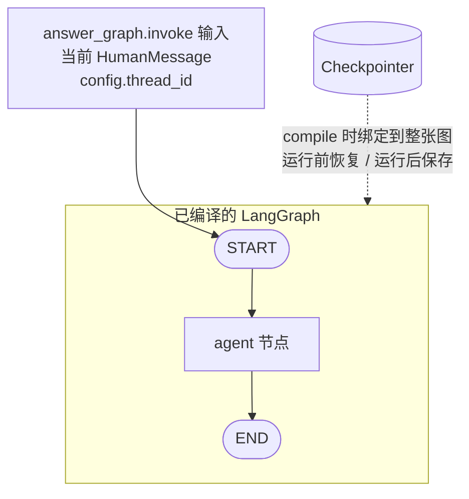

# LangGraph 短期对话记忆

当前实现只提供按 `thread_id` 隔离的短期对话记忆。LangGraph Checkpointer 自动保存并恢复图状态中的 `messages`；没有长期记忆 Store、检索工具、结构化提取或回复后写入节点。

## 图结构



**图的控制流只有一个入口：`START`。** `answer_graph.invoke(...)` 是调用者启动图执行的 API；图启动后从 `START` 按边进入 `agent`，再到 `END`。Checkpointer 不是第二个入口，也不是图节点或连到 Agent 的另一条执行边。它在 `workflow.compile(checkpointer=...)` 时绑定到整张已编译图，LangGraph 根据 invoke config 中的 `thread_id` 在执行前恢复状态，并在执行过程中/结束时持久化状态。

每次 QA 请求只向图提交当前 `HumanMessage`；恢复出的历史由 Checkpointer/LangGraph 合并进本次 `agent` 节点收到的 `state["messages"]`。Agent 将基础 SystemMessage 和本轮企业 QA system prompt 临时放在模型输入前面，返回的状态增量只包含 AI 回复；SystemMessage 不进入 checkpoint state。相同 `thread_id` 会接续历史，不同 `thread_id` 相互隔离。

### `/api/chat` 调用链

```text
POST /api/chat
    -> routes_chat.chat()                         # 取 X-Conversation-Id
    -> ChatService.ask(question, thread_id)       # 读取当前 checkpoint 供 trace 计数
    -> MemoryRuntime.generate_answer_with_memory()
             -> build_memory_agent_graph(llm, checkpointer, system_prompt)
                        -> StateGraph(MemoryGraphState)
                        -> add_node("agent", create_agent_node(...))
                        -> add_edge(START, "agent")
                        -> add_edge("agent", END)
                        -> compile(checkpointer=...)
             -> answer_graph.invoke(
                            {"messages": [HumanMessage(question)]},
                            config={"configurable": {"thread_id": thread_id}},
                    )
                        -> LangGraph 从 START 进入 agent（唯一的图执行入口）
                        -> agent(state, config)
                        -> llm.invoke([SystemMessage] + state["messages"], config=config)
                        -> agent 返回 {"messages": [AIMessage]}
                        -> LangGraph 合并消息并由 Checkpointer 保存状态
    -> 提取最终 AIMessage.content
    -> ChatService.ask() 返回 answer 和 trace
```

上面的 `prepare_context()` 是调用前只读一次 checkpoint，用于 trace 显示已有消息数；它不是图入口，也不负责把历史手动拼到 invoke 输入。真正回答时，`answer_graph.invoke()` 携带相同 `thread_id`，LangGraph 使用绑定的 Checkpointer 恢复并更新图状态。

### 调用链日志

沿调用边界记录阶段日志，统一使用 `memory.*` / `chat.memory.*` 前缀，包含 thread ID、消息数量/类型、回答字符数和耗时；不打印问题、回答或完整 checkpoint 消息正文：

```text
chat.memory.call.start thread_id=... question_chars=... checkpoint_messages=...
memory.graph.build thread_id=... checkpointer=MemorySaver
memory.graph.invoke.start thread_id=... input_message_count=1
memory.agent.invoke thread_id=... message_count=... message_types=['human', 'ai', 'human']
memory.agent.completed thread_id=... response_type=ai
memory.graph.invoke.completed thread_id=... result_message_count=... answer_chars=...
chat.memory.call.completed thread_id=... answer_chars=... duration_ms=...
```

若 LLM 或图执行失败，会记录 `chat.memory.call.failed`，随后由 chat service 返回带错误信息的响应。日志只记录诊断元数据，避免将用户对话正文写入常规服务日志。

## 短期记忆的读与写

### 读取：两个时机

**时机 1：调用前显式读（只读观测）。** `MemoryRuntime.prepare_context()` 在 `answer_graph.invoke()` 之前直接读一次 Checkpointer：

```python
# langchain_memory/app/runtime.py L41-53
def prepare_context(self, thread_id, question) -> MemoryContext:
    conversation_messages: List[BaseMessage] = []
    if thread_id:
        checkpoint_tuple = self.checkpointer.get_tuple(            # L47 显式读
            {"configurable": {"thread_id": thread_id}}
        )
        if checkpoint_tuple is not None:
            channel_values = checkpoint_tuple.checkpoint.get(
                "channel_values", {}                               # L52
            )
            conversation_messages = list(
                channel_values.get("messages", [])                 # L53
            )
```

这次读取只用于 trace 的 `checkpoint_messages_before` 计数和调用前观测；它不修改 checkpoint，也不把历史手动拼进 invoke 输入。

**时机 2：图执行开始时自动读。** `answer_graph.invoke()` 携带 `thread_id` 后，LangGraph 在执行 `agent` 节点前自动加载该 thread 的最新 checkpoint，把历史合并进初始 state：

```python
# langchain_memory/app/runtime.py L97-99
result = answer_graph.invoke(
    {"messages": [HumanMessage(content=question)]},
    config={"configurable": {"thread_id": thread_id}},
)
```

Checkpointer 在 `workflow.compile(checkpointer=...)`（`graph.py:79`）时绑定到整张图。因此 `agent` 节点收到的 `state["messages"]` 已经是「历史消息 + 本轮 HumanMessage」，不需要用户代码手动拼接。

**发送给 LLM 的是全部历史，不是过去 N 条。** `agent` 节点把 `state["messages"]` 整个列表发给模型：

```python
# langchain_memory/app/graph.py L45, L54
messages = state["messages"]                       # L45 全量历史 + 本轮问题
response = llm.invoke([system] + messages, config=config)   # L54 全部发送
```

当前实现没有任何截断、窗口或 N 条限制；`checkpoint_messages_before` 计数是多少，模型输入就包含多少条历史消息。因此当前**不可配置**：没有提供 `N`、token 预算或消息窗口的配置项。对话轮数增多后，模型输入 token 会线性增长，可能触及模型上下文上限或增加费用。

若需要限制，可在 `agent` 节点内（`graph.py:45` 之后、`graph.py:54` 之前）对 `messages` 做截断，例如保留最近 N 条或按 token 预算裁剪；这属于未来扩展，当前代码未实现。

### 写入：agent 节点返回后自动持久化

写入没有显式的用户代码调用，发生在每个 superstep（本图只有 `agent` 一个节点）结束时：

```python
# langchain_memory/app/graph.py L60 — agent 节点返回状态增量
return {"messages": [response]}    # 只包含本轮 AIMessage

# langchain_memory/app/state.py L23 — add_messages reducer 声明
messages: Annotated[List[BaseMessage], add_messages]
```

顺序：

1. `agent` 返回增量 `{"messages": [AIMessage]}`（`graph.py:60`）。
2. `add_messages` reducer（`state.py:23`）把增量合并进已有消息列表；invoke 输入的 HumanMessage 也在这一步进入 state。
3. LangGraph 在 superstep 结束时把更新后的 channel values 通过绑定的 Checkpointer 持久化（`graph.py:79` 编译时绑定）。

总结：**读发生在 invoke 前（显式，`runtime.py:47`）和 invoke 启动时（自动，`runtime.py:97`）；写发生在 `agent` 节点执行完、superstep 提交时（自动，`graph.py:60` + `state.py:23`）**。SystemMessage 只临时加在模型输入前，不进入 state，因此不会被写入。

## QA 流程

1. 用当前问题原文执行企业知识库向量检索。
2. 将企业知识片段放入 `ENTERPRISE KNOWLEDGE` system context；不把短期历史拼进企业检索 query 或 context 字符串。
3. 有 `thread_id` 时，由 LangGraph agent 使用 Checkpointer 恢复历史、生成回答并保存本轮 messages。
4. 没有 `thread_id` 时，沿用原有无状态 `llm_client.generate()` 路径。
5. 不再调用独立的 `record_turn()` 或 `append_turn()`。

## 关键实现

- `langchain_memory/app/graph.py`：`create_agent_node()` 动态构造 SystemMessage；`build_memory_agent_graph()` 建立 `START -> agent -> END`，并编译时绑定 Checkpointer。
- `langchain_memory/app/runtime.py`：`MemoryRuntime.prepare_context()` 只读 Checkpointer；`generate_answer_with_memory()` 每次只提交当前 HumanMessage，并用 `thread_id` 配置图运行。
- `qa_service/pipeline.py`：企业检索和反思流程保持不变；上下文只包含企业知识，有 thread 时走 checkpoint agent。
- `chat_service/api/routes_ask.py`：`X-Conversation-Id` 作为 `thread_id` 传给 pipeline；Ask 路径不再读取用户 ID。
- `langchain_memory/app/state.py`：保持现有 `MemoryGraphState`，状态字段只有 `messages`。

## 隔离与生命周期

- 同一 `thread_id` 在相同应用 Checkpointer 上恢复此前消息。
- 不同 `thread_id` 的 messages 独立。
- 默认 runtime 使用进程内 `MemorySaver`；进程重启后 checkpoint 不持久化。
- `prepare_context()` 的历史读取用于调用前观测和 trace；最终回答的消息历史由绑定到回答图的同一 Checkpointer 管理。

## 验证

从仓库根目录运行：

```bash
python3 -m pytest qa_service/test langchain_memory/tests -q
```

短期测试验证相同 thread 自动恢复、不同 thread 隔离，以及 SystemMessage 不写入图状态。QA 集成测试验证 thread history 用于回答、企业检索只使用当前问题、无 thread 时仍走无状态生成，以及 API 将 conversation ID 映射到 thread ID。

## 源码索引

以下为本次修改后的行号；后续代码编辑可能使其变化。

- `chat_service/api/routes_chat.py:38`：`chat()`，将 `X-Conversation-Id` 作为 `thread_id` 交给 `ChatService.ask()`。
- `chat_service/services/chat/chat_service.py:33`：`ChatService.ask()`，读取 checkpoint 供 trace 统计，再调用 runtime 生成回答。
- `chat_service/services/chat/chat_service.py:69`：`chat.memory.call.*`，记录 runtime 调用开始、失败或完成。
- `langchain_memory/app/runtime.py:41`：`MemoryRuntime.prepare_context()`，按 thread 只读 checkpoint；日志记录消息数量和类型。
- `langchain_memory/app/runtime.py:75`：`generate_answer_with_memory()`，构图并以当前 HumanMessage 和 `thread_id` 调用 `invoke()`。
- `langchain_memory/app/runtime.py:84`：`memory.graph.*`，记录图构建、invoke 开始和结束。
- `langchain_memory/app/graph.py:31`：`create_agent_node()`，临时添加 SystemMessage 并调用 LLM；记录 Agent 进入和完成。
- `langchain_memory/app/graph.py:64`：`build_memory_agent_graph()`，声明唯一控制流 `START -> agent -> END` 并编译时绑定 Checkpointer。
- `langchain_memory/app/runtime.py:117`：`create_memory_runtime()`，只创建 Checkpointer runtime。
- `qa_service/pipeline.py:30`：`answer_question()`，thread-scoped QA 集成。
- `qa_service/pipeline.py:148`：企业知识 context 构造，不拼短期历史。
- `qa_service/pipeline.py:167`：有 thread 时调用 checkpoint agent。
- `chat_service/api/routes_ask.py:32`：读取 conversation ID 并转为 thread ID。
- `langchain_memory/tests/test_short_term_memory.py:24`：Checkpointer 同 thread 恢复及跨 thread 隔离测试。
- `qa_service/test/test_qa_memory_integration.py:50`：QA 短期记忆集成测试。

## Task 2：V2 长期记忆（待执行）

**状态：占位；必须等 Task 1 测试通过、短期记忆稳定后再开始。当前没有实现以下能力。**

- 复用 Task 1 的 Checkpointer 短期记忆基础设施。
- 由 `create_search_memory_tool` 暴露长期记忆检索，由回答 Agent 自主决定是否调用；pipeline 不预先检索。
- 回答结束后通过独立节点或后台任务执行长期记忆写入，不阻塞回答。
- 使用 PostgresStore 与 pgvector 持久化。
- namespace 固定为 `("users", user_id, "memories")`，保持用户隔离。
- 使用 `with_structured_output(MemoryExtraction)` 做结构化提取。
- 不引入硬编码 query 重写规则。
