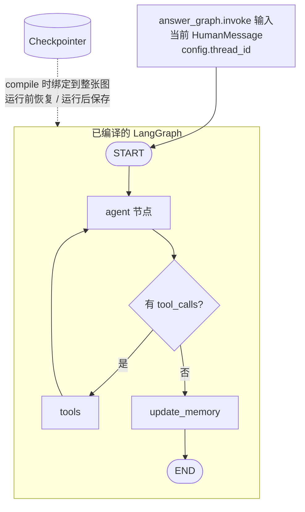
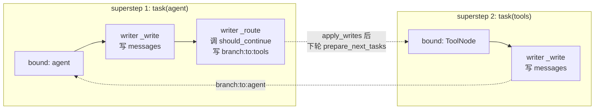
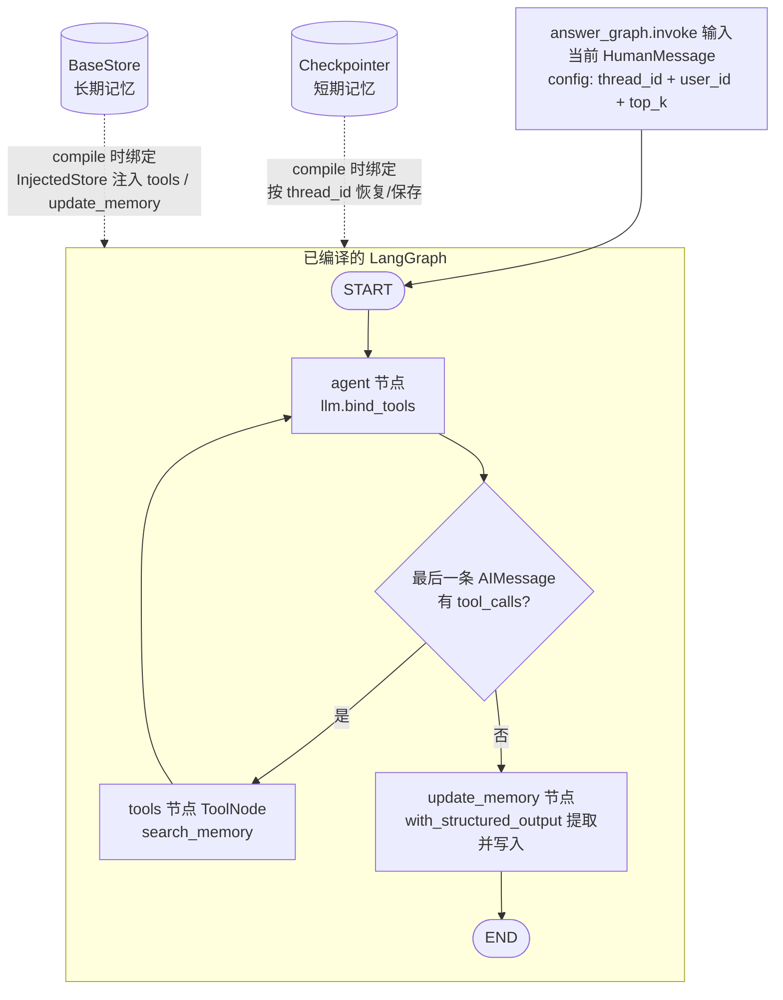
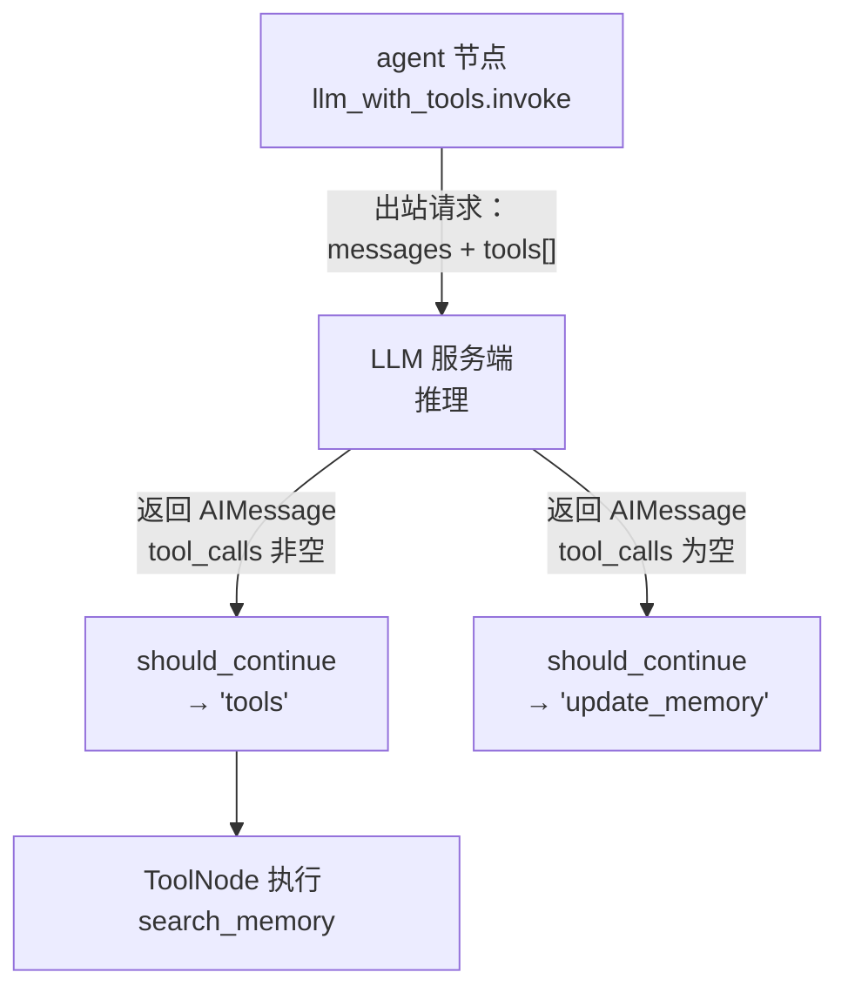

# LangGraph 对话记忆（短期 V1 + 长期 V2）

短期记忆：按 `thread_id` 隔离，LangGraph Checkpointer 自动保存并恢复图状态中的 `messages`。
长期记忆（V2）：按 `user_id` 隔离的语义 Store，由回答 Agent 通过 `search_memory` 工具自主检索，回答结束后由 `update_memory` 节点结构化提取并写入。

## 目录

- [图结构](#图结构)
- [短期记忆的读与写](#短期记忆的读与写)
- [QA 流程](#qa-流程)
- [关键实现](#关键实现)
- [隔离与生命周期](#隔离与生命周期)
- [验证](#验证)
- [源码索引](#源码索引)
- [LangGraph 驱动过程：writer 是什么](#langgraph-驱动过程writer-是什么)
- [长期记忆（V2）Long-term Memory](#长期记忆v2long-term-memory)
  - [模型怎么决定要不要检索长期记忆](#模型怎么决定要不要检索长期记忆)
  - [工具是在哪里构造的（build_memory_agent_graph）](#工具是在哪里构造的build_memory_agent_graph)
  - [should_continue 是怎么被触发的](#should_continue-是怎么被触发的)

## 图结构



> 上图是 V2 的完整控制流；`tools` / `update_memory` 详见 [长期记忆（V2）](#长期记忆v2long-term-memory)。短期记忆的语义未变：Checkpointer 仍在 compile 时绑定到整张图，按 `thread_id` 恢复并持久化 `messages`。

**图的控制流只有一个入口：`START`。** `answer_graph.invoke(...)` 是调用者启动图执行的 API；图启动后从 `START` 按边进入 `agent`。Checkpointer 不是第二个入口，也不是图节点或连到 Agent 的另一条执行边。它在 `workflow.compile(checkpointer=...)` 时绑定到整张已编译图，LangGraph 根据 invoke config 中的 `thread_id` 在执行前恢复状态，并在执行过程中/结束时持久化状态。

每次 QA 请求只向图提交当前 `HumanMessage`；恢复出的历史由 Checkpointer/LangGraph 合并进本次 `agent` 节点收到的 `state["messages"]`。Agent 将基础 SystemMessage 和本轮企业 QA system prompt 临时放在模型输入前面，返回的状态增量只包含 AI 回复；SystemMessage 不进入 checkpoint state。相同 `thread_id` 会接续历史，不同 `thread_id` 相互隔离。

### `/api/chat` 调用链

```text
POST /api/chat
    -> routes_chat.chat()                         # 取 X-Conversation-Id / X-User-Id
    -> ChatService.ask(question, thread_id, user_id)  # 读取当前 checkpoint 供 trace 计数
    -> MemoryRuntime.generate_answer_with_memory()
             -> build_memory_agent_graph(llm, checkpointer, system_prompt, store)
                        -> StateGraph(MemoryGraphState)
                        -> add_node("agent", create_agent_node(..., tools=[search_memory]))
                        -> add_node("tools", ToolNode(...))
                        -> add_node("update_memory", create_update_memory_node(...))
                        -> add_edge(START, "agent")
                        -> add_conditional_edges("agent", should_continue,
                               {"tools": "tools", "update_memory": "update_memory"})
                        -> add_edge("tools", "agent")
                        -> add_edge("update_memory", END)
                        -> compile(checkpointer=..., store=...)
             -> answer_graph.invoke(
                            {"messages": [HumanMessage(question)]},
                            config={"configurable": {"thread_id": ..., "user_id": ..., "top_k": ...}},
                    )
                        -> LangGraph 从 START 进入 agent（唯一的图执行入口）
                        -> agent(state, config)
                        -> llm_with_tools.invoke([SystemMessage] + state["messages"], config=config)
                        -> 有 tool_calls 时 agent ↔ tools 循环，否则进入 update_memory
                        -> LangGraph 合并消息并由 Checkpointer 保存状态
    -> 提取最终 AIMessage.content
    -> ChatService.ask() 返回 answer 和 trace
```

上面的 `prepare_context()` 是调用前只读一次 checkpoint，用于 trace 显示已有消息数；它不是图入口，也不负责把历史手动拼到 invoke 输入。真正回答时，`answer_graph.invoke()` 携带相同 `thread_id`，LangGraph 使用绑定的 Checkpointer 恢复并更新图状态。

### 调用链日志

沿调用边界记录阶段日志，统一使用 `memory.*` / `chat.memory.*` 前缀，包含 thread ID、消息数量/类型、回答字符数和耗时；不打印问题、回答或完整 checkpoint 消息正文：

```text
chat.memory.call.start thread_id=... question_chars=... checkpoint_messages=...
memory.graph.build thread_id=... checkpointer=MemorySaver
memory.graph.invoke.start thread_id=... input_message_count=1
memory.agent.invoke thread_id=... message_count=... message_types=['human', 'ai', 'human']
memory.agent.completed thread_id=... response_type=ai
memory.graph.invoke.completed thread_id=... result_message_count=... answer_chars=...
chat.memory.call.completed thread_id=... answer_chars=... duration_ms=...
```

若 LLM 或图执行失败，会记录 `chat.memory.call.failed`，随后由 chat service 返回带错误信息的响应。日志只记录诊断元数据，避免将用户对话正文写入常规服务日志。

> **调试例外**：`memory.agent.request_payload` 会打印**完整出站请求体**（含 `messages` 全文与 `tools` schema），因此包含用户问题与全部历史，**与上述「不打印对话正文」的约定相反**。它只用于排查模型为何不调用工具，上线前应移除或降级。实现见 `_build_request_payload_preview()`（`app/graph.py:59`）与 `agent` 内的调用点（`app/graph.py:112`）。
>
> 该函数依赖 provider 的私有方法 `ChatOpenAI._get_request_payload`，因此：
> - 只有 OpenAI 兼容模型会打出这条日志；`DeterministicMockChatModel` 等自研/测试模型没有该方法，会**静默跳过**（实测 `request_payload` 出现 0 次）。
> - 失败时只记 `memory.agent.payload.preview_failed` 并继续请求，不会中断回答。
> - 重建时把 `bind_tools` 产生的 `RunnableBinding.kwargs`（含 `tools`）原样回填，因此**包含实际发出的 schema**。

## 短期记忆的读与写

### 读取：两个时机

**时机 1：调用前显式读（只读观测）。** `MemoryRuntime.prepare_context()` 在 `answer_graph.invoke()` 之前直接读一次 Checkpointer：

```python
# langchain_memory/app/runtime.py L57-70
def prepare_context(self, thread_id, question) -> MemoryContext:
    conversation_messages: List[BaseMessage] = []
    if thread_id:
        checkpoint_tuple = self.checkpointer.get_tuple(            # L63 显式读
            {"configurable": {"thread_id": thread_id}}
        )
        if checkpoint_tuple is not None:
            channel_values = checkpoint_tuple.checkpoint.get(
                "channel_values", {}                               # L68
            )
            conversation_messages = list(
                channel_values.get("messages", [])                 # L69
            )
```

这次读取只用于 trace 的 `checkpoint_messages_before` 计数和调用前观测；它不修改 checkpoint，也不把历史手动拼进 invoke 输入。

**时机 2：图执行开始时自动读。** `answer_graph.invoke()` 携带 `thread_id` 后，LangGraph 在执行 `agent` 节点前自动加载该 thread 的最新 checkpoint，把历史合并进初始 state：

```python
# langchain_memory/app/runtime.py L127-130
result = answer_graph.invoke(
    {"messages": [HumanMessage(content=question)]},
    config={"configurable": {"thread_id": thread_id}},
)
```

Checkpointer 在 `workflow.compile(checkpointer=...)`（`graph.py:241`）时绑定到整张图。因此 `agent` 节点收到的 `state["messages"]` 已经是「历史消息 + 本轮 HumanMessage」，不需要用户代码手动拼接。

**发送给 LLM 的是全部历史，不是过去 N 条。** `agent` 节点把 `state["messages"]` 整个列表发给模型：

```python
# langchain_memory/app/graph.py L101, L81
messages = state["messages"]                       # L72 全量历史 + 本轮问题
response = llm_with_tools.invoke([system] + messages, config=config)   # L81 全部发送
```

当前实现没有任何截断、窗口或 N 条限制；`checkpoint_messages_before` 计数是多少，模型输入就包含多少条历史消息。因此当前**不可配置**：没有提供 `N`、token 预算或消息窗口的配置项。对话轮数增多后，模型输入 token 会线性增长，可能触及模型上下文上限或增加费用。

若需要限制，可在 `agent` 节点内（`graph.py:101` 之后、`graph.py:118` 之前）对 `messages` 做截断，例如保留最近 N 条或按 token 预算裁剪；这属于未来扩展，当前代码未实现。

### 写入：agent 节点返回后自动持久化

写入没有显式的用户代码调用，发生在每个 superstep（本图只有 `agent` 一个节点）结束时：

```python
# langchain_memory/app/graph.py L125 — agent 节点返回状态增量
return {"messages": [response]}    # 只包含本轮 AIMessage

# langchain_memory/app/state.py L23 — add_messages reducer 声明
messages: Annotated[List[BaseMessage], add_messages]
```

顺序：

1. `agent` 返回增量 `{"messages": [AIMessage]}`（`graph.py:125`）。
2. `add_messages` reducer（`state.py:23`）把增量合并进已有消息列表；invoke 输入的 HumanMessage 也在这一步进入 state。
3. LangGraph 在 superstep 结束时把更新后的 channel values 通过绑定的 Checkpointer 持久化（`graph.py:241` 编译时绑定）。

总结：**读发生在 invoke 前（显式，`runtime.py:63`）和 invoke 启动时（自动，`runtime.py:127`）；写发生在 `agent` 节点执行完、superstep 提交时（自动，`graph.py:125` + `state.py:23`）**。SystemMessage 只临时加在模型输入前，不进入 state，因此不会被写入。

## QA 流程

1. 用当前问题原文执行企业知识库向量检索。
2. 将企业知识片段放入 `ENTERPRISE KNOWLEDGE` system context；不把短期历史拼进企业检索 query 或 context 字符串。
3. 有 `thread_id` 时，由 LangGraph agent 使用 Checkpointer 恢复历史、生成回答并保存本轮 messages。
4. 没有 `thread_id` 时，沿用原有无状态 `llm_client.generate()` 路径。
5. 不再调用独立的 `record_turn()` 或 `append_turn()`。

## 关键实现

- `langchain_memory/app/graph.py`：`create_agent_node()` 动态构造 SystemMessage；`build_memory_agent_graph()` 建立 `START -> agent -> END`，并编译时绑定 Checkpointer。
- `langchain_memory/app/runtime.py`：`MemoryRuntime.prepare_context()` 只读 Checkpointer；`generate_answer_with_memory()` 每次只提交当前 HumanMessage，并用 `thread_id` 配置图运行。
- `qa_service/pipeline.py`：企业检索和反思流程保持不变；上下文只包含企业知识，有 thread 时走 checkpoint agent。
- `chat_service/api/routes_ask.py`：`X-Conversation-Id` 作为 `thread_id` 传给 pipeline；Ask 路径不再读取用户 ID。
- `langchain_memory/app/state.py`：保持现有 `MemoryGraphState`，状态字段只有 `messages`。

## 隔离与生命周期

- 同一 `thread_id` 在相同应用 Checkpointer 上恢复此前消息。
- 不同 `thread_id` 的 messages 独立。
- 默认 runtime 使用进程内 `MemorySaver`；进程重启后 checkpoint 不持久化。
- `prepare_context()` 的历史读取用于调用前观测和 trace；最终回答的消息历史由绑定到回答图的同一 Checkpointer 管理。

## 验证

从仓库根目录运行：

```bash
python3 -m pytest qa_service/test langchain_memory/tests -q
```

短期测试验证相同 thread 自动恢复、不同 thread 隔离，以及 SystemMessage 不写入图状态。QA 集成测试验证 thread history 用于回答、企业检索只使用当前问题、无 thread 时仍走无状态生成，以及 API 将 conversation ID 映射到 thread ID。

## 源码索引

以下为本次修改后的行号；后续代码编辑可能使其变化。

- `chat_service/api/routes_chat.py:38`：`chat()`，将 `X-Conversation-Id` 作为 `thread_id` 交给 `ChatService.ask()`。
- `chat_service/services/chat/chat_service.py:33`：`ChatService.ask()`，读取 checkpoint 供 trace 统计，再调用 runtime 生成回答。
- `chat_service/services/chat/chat_service.py:69`：`chat.memory.call.*`，记录 runtime 调用开始、失败或完成。
- `langchain_memory/app/runtime.py:57`：`MemoryRuntime.prepare_context()`，按 thread 只读 checkpoint；日志记录消息数量和类型。
- `langchain_memory/app/runtime.py:91`：`generate_answer_with_memory()`，构图并以当前 HumanMessage 和 `thread_id` 调用 `invoke()`。
- `langchain_memory/app/runtime.py:110`：`memory.graph.*`，记录图构建、invoke 开始和结束。
- `langchain_memory/app/graph.py:82`：`create_agent_node()`，临时添加 SystemMessage 并调用 LLM；记录 Agent 进入和完成。
- `langchain_memory/app/graph.py:203`：`build_memory_agent_graph()`，声明唯一控制流 `START -> agent -> END` 并编译时绑定 Checkpointer。
- `langchain_memory/app/runtime.py:153`：`create_memory_runtime()`，只创建 Checkpointer runtime。
- `qa_service/pipeline.py:30`：`answer_question()`，thread-scoped QA 集成。
- `qa_service/pipeline.py:148`：企业知识 context 构造，不拼短期历史。
- `qa_service/pipeline.py:167`：有 thread 时调用 checkpoint agent。
- `chat_service/api/routes_ask.py:32`：读取 conversation ID 并转为 thread ID。
- `langchain_memory/tests/test_short_term_memory.py:24`：Checkpointer 同 thread 恢复及跨 thread 隔离测试。
- `qa_service/test/test_qa_memory_integration.py:50`：QA 短期记忆集成测试。
- `langchain_memory/app/long_memory.py:43`：`create_memory_store()`，带 IndexConfig 的 Store 工厂。
- `langchain_memory/app/long_memory.py:71`：`retrieve_user_memories()`，namespace 内语义检索。
- `langchain_memory/app/long_memory.py:103`：`save_user_memory()`，长期记忆写入。
- `langchain_memory/app/long_memory.py:138`：`extract_and_save_memory()`，结构化提取 + 条件写入。
- `langchain_memory/app/long_memory.py:186`：`create_search_memory_tool()`，Agent 自主检索工具。
- `langchain_memory/app/long_memory_prompts.py:12`：`MemoryExtraction` schema 与提取提示词。
- `langchain_memory/app/graph.py:130`：`should_continue()`，tool_calls 条件边。
- `langchain_memory/app/graph.py:143`：`create_update_memory_node()`，回答后写入节点。
- `langchain_memory/app/graph.py:203`：`build_memory_agent_graph()`，同时绑定 checkpointer 与 store。
- `langchain_memory/app/config.py:27`：`MEMORY_EMBEDDING_MODEL/DIMS/TOP_K` 配置；`app/config.py:53`：`get_embeddings()`。
- `langchain_memory/tests/test_long_term_memory.py`：长期记忆测试。

## LangGraph 驱动过程：writer 是什么

本节解释运行时机制，用于读懂上面 `should_continue` 的调用栈。所有结论均来自 langgraph 0.6.11 源码 + 本仓库实测。

### 节点不是函数，是容器

`StateGraph.add_node("agent", func)` 里的 `func` 不会直接被调用。编译时它被包成 `PregelNode`（`pregel/_read.py:97`），一个**数据容器**，核心是四个字段：

| 字段 | 含义 | `agent` 节点的实际值（实测） |
| --- | --- | --- |
| `bound` | 节点的主逻辑，就是你传的函数 | `create_agent_node.<locals>.agent` |
| `writers` | **`bound` 执行完之后**依次跑的 Runnable 列表 | `['_write', '_route']` |
| `triggers` | 哪些 channel 变化会唤醒本节点 | `['branch:to:agent']` |
| `channels` | 本节点要从哪些 channel 读输入 | `['messages']` |

`PregelNode.node`（`_read.py:203`）把二者拼成一条 `RunnableSeq`：

```python
# pregel/_read.py L212-213
elif writers:
    return RunnableSeq(self.bound, *writers)   # agent → _write → _route
```

实测三个节点的执行序列：

```text
node 'agent'          steps = ['agent', '_write', '_route']   ← 有条件边，多一个 writer
node 'tools'          steps = ['tools', '_write']
node 'update_memory'  steps = ['update_memory', '_write']
```

### writer 是什么

**writer 就是「节点主逻辑跑完之后，由框架自动接着执行的 Runnable」。** 它是框架注入的，你的代码里看不到、也无需调用。

Writer 有两类，本图都有：

**① `ChannelWrite`（名字 `_write`）— 写 state。** 每个节点都有，由 `attach_node` 无条件加上去（`graph/state.py:1038`）。它把 `bound` 的返回值按 `add_messages` 等 reducer 规则转换成 `(channel, value)` 写入。`agent` 返回的 `{"messages": [response]}` 就是被它写进 `messages` channel 的。

**② `BranchSpec._route`（名字 `_route`）— 就是你的条件边。** 只有 `add_conditional_edges` 才会加，且加在 `writers` 列表**末尾**（`graph/state.py:1120`）：

```python
# graph/state.py L1120
self.nodes[start].writers.append(branch.run(get_writes, reader))
```

`reader` 是 `partial(ChannelRead.do_read, ..., fresh=True)`（`state.py:1109`），作用见下文。

**writer 能做什么**：`_route` 内部对 `writer(destinations, False)` 的返回值判断，若结果全是 `PASSTHROUGH` 就返回 `ChannelWrite(entries)` 继续传，否则**不再往下传给下一个 writer**。这意味着当前只有一个条件边时行为简单，但 `add_conditional_edges` 多次调用会串联成 `RunnableSeq`，前一分支的返回值会成为后一分支的输入。

### 驱动循环：superstep 与 channel

`invoke()` 的主循环在 `pregel/main.py:3085` → `stream()` → 每轮调 `runner.tick()`。`tick()`（`pregel/_loop.py:439`）做三件事：

1. `prepare_next_tasks(...)` — 扫描上一 superstep 更新过的 channel，找出 `triggers` 命中这些 channel 的节点，为每个节点建一个 task。
2. 跑完所有 task（并发），每个 task 内部就是上面那条 `RunnableSeq`：`bound` → writers。
3. `after_tick()`（`_loop.py:521`）调 `apply_writes(...)` — 把 task 的 writes 真正落到 channel，并更新 checkpoint。

**关键：节点之间不直接调用，全靠 channel 传信。** 每个节点有一条专属的 `branch:to:<name>` channel（实测 `branch:to:agent` / `branch:to:tools` / `branch:to:update_memory`，类型均为 `EphemeralValue`）。`_route` 查表得到 `"tools"` 后，`get_writes`（`state.py:1077`）把它包成 `ChannelWriteEntry("branch:to:tools", None)` 写入；下一个 superstep `prepare_next_tasks` 看到 `branch:to:tools` 被更新，就唤醒 `tools` 节点。



实测本图一次带工具调用的问答共 4 个 superstep（`stream_mode="updates"`）：

```text
step 1: node=agent          update=['messages']   ← 返回带 tool_calls 的 AIMessage
step 2: node=tools          update=['messages']   ← 追加 ToolMessage
step 3: node=agent          update=['messages']   ← 最终答案
step 4: node=update_memory  update=None           ← 写长期记忆，然后 END
```

### 为什么 should_continue 能看到 agent 刚写的消息

这是 `reader` 的作用。`_route`（`graph/_branch.py:148`）第一步是 `value = reader(config)`，而这个 reader 最终走到 `local_read`（`pregel/_algo.py:174`），源码注释写得很直白：

> *Used by conditional edges to read a copy of the state with reflecting the writes from that node only.*

它把**本 task 已产生的 writes** 先叠加到 channel 副本上再读（`_algo.py:197-205`）：

```python
if fresh:
    for k in channels:
        cc = channels[k].copy()
        cc.update(updated[k])      # 叠加本 task 的 writes
        local_channels[k] = cc
    values = read_channels(local_channels, select)
```

所以 `should_continue(state)` 拿到的是「**旧 state + agent 本次输出**」的快照，`state["messages"][-1]` 必然是 agent 刚生成的 `AIMessage`。这也解释了为什么路由能立刻判断 `tool_calls`——它和 agent 在同一次 `task.proc.invoke` 里同步执行，**不经过任何 superstep 边界**。

### 与调用栈的对应

把机制和上一节的栈对齐：

| 栈帧 | 对应机制 |
| --- | --- |
| `pregel/_runner.py:162` | `tick()` 里跑 task |
| `pregel/_retry.py:42` | `task.proc.invoke(task.input, config)`，`proc` 就是 `PregelNode.node`（那条 RunnableSeq） |
| `_internal/_runnable.py:659` | `RunnableSeq.invoke` 遍历 `steps`，`i>0` 的都是 writer |
| `_internal/_runnable.py:401` | `steps[0]` = `bound` = `agent` 执行完毕 |
| `graph/_branch.py:168` | `steps[2]` = `_route`，执行 `self.path.invoke(...)` |
| `_internal/_runnable.py:394` | 被调用的 `self.path` 就是 `should_continue` |

**为什么栈里看不到 `should_continue` 自己的帧**：它是当前栈顶函数，`traceback.format_stack()` 加 `[:-1]` 会切掉最后一项。若要看全，去掉 `[:-1]`。

### 排查清单

- **想知道是谁触发了某段代码**：在函数里 `print("".join(traceback.format_stack()[:-1]))`，看 `_branch.py:168` 之上是否有 `_runnable.py:659`——有就说明它是 writer 链的一部分。
- **路由函数没被调用**：确认 `add_conditional_edges` 的 `source` 与 `add_node` 的名字一致，且 `compile()` 在 `add_*` 之后调用（`state.py:644` 会对已编译图告警并忽略）。
- **路由函数抛 `KeyError`**：`path_map` 是查表用的，返回值必须是它的 key。实测返回 `"bogus_key"` 直接 `KeyError: 'bogus_key'`（`_branch.py:205`）。
- **想让路由看到更多字段**：`reader` 的 `select` 来自 `branch.input_schema` 或该节点的 `input_schema`（`state.py:1096`）；本图 `MemoryGraphState` 只有 `messages`，所以 `should_continue` 只能看 `messages`。要传别的数据，需加到 state schema 或改用 `Command(goto=...)`。
- **`add_conditional_edges` 的 `path` 若省略 `path_map`**：LangGraph 会尝试从返回类型注解 `Literal[...]` 推断（`_branch.py:115`）。本项目显式给了字典，未走该推断。

## 长期记忆（V2）Long-term Memory

**状态：已实现并通过测试（38 passed, 1 skipped）。** 长期记忆放在独立模块，不与短期记忆代码混合：

- `app/long_memory.py`：Store 工厂、检索、写入、结构化提取、`search_memory` 工具。
- `app/long_memory_prompts.py`：`MemoryExtraction` schema 与提取提示词。
- `app/graph.py` 只做图装配，从 `long_memory.py` 导入组件；短期记忆（Checkpointer、thread 历史读取）保持原位。

### V2 图结构



条件边 `should_continue`（`app/graph.py:130`）只判断最后一条 `AIMessage` 是否带 `tool_calls`：有则去 `tools`，否则去 `update_memory`。长期记忆检索完全由 LLM 在 tool-calling 循环里自主决定，pipeline 不预先检索，也没有任何硬编码 query 重写规则。

### 核心代码

Store 工厂（`app/long_memory.py:43`）：配置 `IndexConfig(dims=MEMORY_EMBEDDING_DIMS, embed=get_embeddings(), fields=["content"])`，`fields=["content"]` 使 `store.search(query=...)` 能对 memory 正文做语义检索；`embeddings`/`dims` 参数保留切换到 PostgresStore 的接口空间。

```python
# langchain_memory/app/long_memory.py L43-68（节选）
def create_memory_store(embeddings=None, dims=EMBEDDING_DIMS) -> InMemoryStore:
    active_embeddings = embeddings if embeddings is not None else app_config.get_embeddings()
    index = IndexConfig(dims=dims, embed=active_embeddings, fields=list(MEMORY_INDEX_FIELDS))
    store = InMemoryStore(index=index)
    return store
```

检索工具（`app/long_memory.py:186`）：schema 只向 LLM 暴露 `query`；`config`/`store` 由 LangGraph 注入，`user_id`、`top_k` 从 `config["configurable"]` 读取，LLM 不可见。

```python
# langchain_memory/app/long_memory.py L186-226（节选）
@tool
def search_memory(
    query: str,
    config: RunnableConfig,
    store: Annotated[BaseStore, InjectedStore()],
) -> str:
    configurable = (config or {}).get("configurable", {})
    user_id = configurable.get("user_id")
    top_k = int(configurable.get("top_k") or default_top_k)
    memories = retrieve_user_memories(store=store, user_id=user_id, query=query, top_k=top_k)
```

写入节点（`app/graph.py:143`）：回答结束后执行，不暴露为工具；`llm.with_structured_output(MemoryExtraction)` 结构化提取，失败只记日志、不中断回答。

```python
# langchain_memory/app/graph.py L143-160（节选）
def create_update_memory_node(llm: BaseChatModel):
    extraction_llm = llm.with_structured_output(MemoryExtraction)
    def update_memory(state, config, *, store: BaseStore):
        user_id = config.get("configurable", {}).get("user_id")
        # 取最新 HumanMessage → extract_and_save_memory(store, user_id, ...)
        return {}
```

提取 schema 与提示词见 `app/long_memory_prompts.py:12`（`MemoryExtraction`）与 `MEMORY_EXTRACTION_PROMPT`（允许：稳定偏好/长期背景/长期目标/明确要求记住；禁止：临时问题、数学计算、一次性闲聊、凭证类敏感信息）。

### 模型怎么决定要不要检索长期记忆

**结论：决策完全发生在 LLM 服务端，本项目没有任何一行 Python 参与判断。** 没有关键词匹配、没有相似度阈值、没有预检索 pipeline。`should_continue` 只负责读取模型已经做出的决定。



#### 环节一：声明（本地，唯一可控的一环）

`app/graph.py:95` 把工具绑定到模型上：

```python
# langchain_memory/app/graph.py L95
llm_with_tools = llm.bind_tools(list(tools)) if tools else llm
```

实测 `bind_tools` 的出站 kwargs **除 `tools` 外为空**，即没有传 `tool_choice`：

```text
bind_tools non-tools kwargs: {}
tool_choice in payload: False
```

OpenAI 侧在未指定 `tool_choice` 时默认为 `"auto"`——这正是"模型自行决定"的开关。三种取值的效果：

| `tool_choice` | 效果 |
| --- | --- |
| 不传（**当前**） | `"auto"`，模型自行判断是否调用 |
| `"required"` | 强制每次都检索，无法跳过 |
| `"none"` | 完全禁用工具 |

#### 环节二：决策（LLM 服务端，本地不可见）

实测模型收到的**全部**输入只有两样：

```text
SystemMessage | '你是一个智能对话助手。请用礼貌、专业、自然的语言回答用户的问题。'
HumanMessage  | '我适合用什么语言写后端？'
tools         | [search_memory 的 function 定义]
```

注意 system prompt（`app/prompts.py`）**完全没有提到长期记忆**。也就是说，模型判断"要不要检索"的唯一依据是 `tools` 数组里的 `description`。模型决定调用就返回带 `tool_calls` 的 `AIMessage`，不调用就返回纯文本。

#### 环节三：落地（本地，只读结果）

`should_continue`（`app/graph.py:130`）不判断、不干预，只读：

```python
if isinstance(last_message, AIMessage) and last_message.tool_calls:
    return "tools"
return "update_memory"
```

实测对照：模型返回 `tool_calls=[{'name':'search_memory', ...}]` 时该函数被 `ToolNode._run_one`（`prebuilt/tool_node.py:445`）调用一次；模型直接返回文本的对照组中该函数**一次都没被调用**。

#### description 就是控制开关

`@tool`（`app/long_memory.py:193`）把 docstring 直接作为 `description` 发给模型，因此**这段文字是唯一的调节手段**：

```text
Search the current user's long-term memory.

Call this only when the answer depends on the user's stable
preferences, long-term background, long-term goals, or facts the user
previously asked to remember. Do not call it for questions that can
be answered from the current conversation alone.

``query`` must be a standalone, semantically complete search phrase
that makes sense without the surrounding conversation.
```

- "Call this **only when** …" / "**Do not call it for** …" 是双向约束，用来平衡漏召与误召。
- 最后一段要求 `query` 自足，避免模型把 "他" 之类指代直接当检索词。

要调整检索倾向（更激进 / 更保守），**改这段文字即可，无需改动任何 Python 逻辑**。

> **注意缩进**：`@tool` 对 docstring 只去掉首尾空白行，**不做 dedent**。实测发出的 description 里第 2 行起仍带 8 个空格源码缩进（`line 0` 缩进为 0，其余为 8）。多数模型能容忍，但若要改写这段描述，建议写成单行，或显式用 `inspect.cleandoc` 处理，避免缩进噪声影响判断。
>
> 另外：docstring 内**不要**写任何调试代码。`@tool` 会把 docstring 整段发给模型，之前误写进去的 `logger.info(...)` 会变成提示词的一部分而永不执行。

#### 与写入侧的对称性

检索（读）是模型自主决定，写（存）是结构化输出显式决策，两套机制：

| 维度 | 读：长期记忆检索 | 写：长期记忆写入 |
| --- | --- | --- |
| 触发者 | LLM 自主选择调用 `search_memory` | `update_memory` 节点固定执行 |
| 判定方式 | 是否返回 `tool_calls` | `with_structured_output` 得到 `should_store: bool` |
| 判定依据 | docstring `description`（发给模型的文本） | `MEMORY_EXTRACTION_PROMPT` + `MemoryExtraction` schema |
| 失败降级 | 检索为空时返回中文提示文本 | 异常只记日志，不中断已完成的回答 |

判定 schema 见 `app/long_memory_prompts.py:12`（`should_store` 的 `Field(description=...)` 同样是对模型的语义约束）。

### 工具是在哪里构造的（`build_memory_agent_graph`）

工具**没有单独的「初始化」步骤**，而是在每次构图时由 `build_memory_agent_graph()` 按需创建。调用方通常什么都不传，走默认分支。

**第 1 步：决定工具列表。** `app/graph.py:219-184`——判断条件是 `tools is not None`，不是 `if tools`：

```python
# langchain_memory/app/graph.py L219-184
active_tools: List[BaseTool] = (
    list(tools)
    if tools is not None
    else [create_search_memory_tool(default_top_k=app_config.MEMORY_TOP_K)]
)
```

三种情况：

| 传入 `tools` | 结果 | 说明 |
| --- | --- | --- |
| `None`（默认，线上路径） | `[search_memory]` | 自动创建长期记忆检索工具，`default_top_k` 取 `MEMORY_TOP_K`（默认 3） |
| `[]`（空列表） | `[]` | **被显式尊重**，不绑定任何工具；`agent` 退化为纯对话，图结构仍然包含 `tools` 节点但永不可达 |
| `[my_tool, ...]` | 原样使用 | 替换默认工具集，`ToolNode` 只执行这里传入的工具 |

因为条件写的是 `is not None`，显式传 `[]` 才能表达「不要工具」；`None` 永远代表「给我默认的 `search_memory`」。

**第 2 步：工具对象本体。** `create_search_memory_tool()`（`app/long_memory.py:186`）是一个**工厂函数**：内部定义一个被 `@tool` 装饰的嵌套函数并返回它。工具的 `name` 来自内层函数名（`search_memory`），`description` 来自它的 docstring——这两者就是模型做决策时看到的全部说明文字。因为是工厂而非模块级常量，每次构图都会得到一个新的工具实例，闭包捕获本次的 `default_top_k`。

**第 3 步：把工具声明给 LLM。** `app/graph.py:95`——工具被绑定到模型上，而不是由 pipeline 预检索：

```python
# langchain_memory/app/graph.py L95
llm_with_tools = llm.bind_tools(list(tools)) if tools else llm
```

**第 4 步：把工具交给执行器。** `app/graph.py:230`——`ToolNode` 是真正调用工具的节点，它按工具名建索引来分发 LLM 发来的 `tool_call`：

```python
# langchain_memory/app/graph.py L226-192
workflow.add_node("agent", create_agent_node(active_llm, system_prompt=system_prompt, tools=active_tools))
workflow.add_node("tools", ToolNode(active_tools))
workflow.add_node("update_memory", create_update_memory_node(active_llm))
```

**LLM 能看到什么、看不到什么。** 经 `llm.bind_tools([search_memory])` 实际发出的 function 定义（已验证）只有 `query` 一个参数：

```json
{
  "type": "function",
  "function": {
    "name": "search_memory",
    "description": "Search the current user's long-term memory. ...",
    "parameters": {
      "properties": { "query": { "type": "string" } },
      "required": ["query"],
      "type": "object"
    }
  }
}
```

`config: RunnableConfig` 和 `store: Annotated[BaseStore, InjectedStore()]` 都不在这个 schema 里，因此模型无法伪造它们：

- `store` 由 `InjectedStore()` 标记，LangGraph 在调用工具时从 `compile(store=...)` 绑定的图级 Store 取值并注入。
- `config` 由 LangGraph 注入当前运行的 config。
- `user_id` / `top_k` 在工具函数体内从 `config["configurable"]` 读取（`app/long_memory.py:211-212`），完全不出现在工具签名里——调用方在 `invoke(config=...)` 传入，模型不可见、不可改。

### `should_continue` 是怎么被触发的

`should_continue` **不是节点**，而是一个路由函数。它通过 `add_conditional_edges` 注册在 `agent` 节点之后，由 LangGraph 在 `agent` 返回之后自动调用，业务代码不直接调用它。

#### 实测调用栈（`traceback.format_stack()`）

在 `app/graph.py:130-97` 临时插入打印后，**一次带工具调用的问答共打印两次**，两次栈完全相同：

```text
============================== should_continue stack trace ==============================
  File "<stdin>", line 20, in <module>
  File ".../langgraph/pregel/main.py", line 3085, in invoke
    for chunk in self.stream(
  File ".../langgraph/pregel/main.py", line 2674, in stream
    for _ in runner.tick(
  File ".../langgraph/pregel/_runner.py", line 162, in tick
    run_with_retry(
  File ".../langgraph/pregel/_retry.py", line 42, in run_with_retry
    return task.proc.invoke(task.input, config)
  File ".../langgraph/_internal/_runnable.py", line 659, in invoke
    input = step.invoke(input, config)
  File ".../langgraph/_internal/_runnable.py", line 401, in invoke
    ret = self.func(*args, **kwargs)
  File ".../langgraph/graph/_branch.py", line 168, in _route
    result = self.path.invoke(value, config)
  File ".../langgraph/_internal/_runnable.py", line 394, in invoke
    ret = context.run(self.func, *args, **kwargs)
```

**谁调用了 `should_continue`：没有业务代码，是 LangGraph 的 Pregel 运行时。** 自底向上读：

| 帧 | 角色 |
| --- | --- |
| `graph/_branch.py:168` `_route` | **直接调用者**。`BranchSpec` 把路由函数包成 `RunnableCallable(func=self._route)`（`_branch.py:131`），`_route` 内执行 `self.path.invoke(...)`；`self.path` 就是 `add_conditional_edges` 传入的 `should_continue` |
| `_internal/_runnable.py:394` | `RunnableCallable.invoke` 用 `context.run` 执行被包装的函数 |
| `_internal/_runnable.py:401` | 上一层 `RunnableCallable`（即 `agent` 节点本身）执行完 |
| `_internal/_runnable.py:659` | `RunnableSequence.invoke` 的 `else` 分支，遍历 `steps[i>0]` 的 writer |
| `pregel/_retry.py:42` | 带重试策略执行任务 |
| `pregel/_runner.py:162` | 一个 superstep 的 tick |
| `pregel/main.py:2674 / 3085` | `stream` / `invoke` 主循环 |

**关键结论：条件边是节点步骤的一部分，不是独立的 Pregel task。** `_branch.py` 的 `run()` 用 `ChannelWrite.register_writer(...)`（`_branch.py:130-131`）把路由注册为 **writer**；而 `_runnable.py:645-660` 的 `RunnableSequence.invoke` 明确注释 `1st step is the actual node, others are writers`，对 `i > 0` 的 step 走 `input = step.invoke(input, config)`，因此路由在**同一个 `RunnableSequence` 调用内、紧跟在 `agent` 执行之后**同步执行。

这解释了为什么栈里**看不到** `agent` 节点函数本体、也看不到 `build_memory_agent_graph`：路由不是被单独调度的 task，而是 `agent` 所在 step 的后续 writer，用的是 `agent` 返回后的新 state。也解释了 `should_continue` 为什么**永远不会看到 `ToolMessage` 结尾的 state**——`tools -> agent` 是无条件边，路由只在 `agent` 之后求值一次；一旦 `ToolNode` 执行完，state 末尾是 `ToolMessage`，但下一跳是直接去 `agent`，不经过路由。

> 排查提示：栈顶第 11 层 `context.run(self.func, ...)`（`_runnable.py:394`）里被调用的 `self.func` 就是 `should_continue` 本身，但 `traceback.format_stack()` 只打印到当前函数边界，所以输出里看不到 `graph.py:130` 那一帧——它就是这段代码所在的位置。若要连同当前帧一起显示，去掉切片 `[:-1]`。

#### 触发时点与路由结果（实测）

**注册。** `app/graph.py:233-197`——第二个参数是路由函数，第三个参数是「返回值 → 目标节点名」的映射表：

```python
# langchain_memory/app/graph.py L233-197
workflow.add_conditional_edges(
    "agent",
    should_continue,
    {"tools": "tools", "update_memory": "update_memory"},
)
```

**触发时机。** 每当 `agent` 节点执行完毕，LangGraph 在同一个 superstep 的「分支」阶段，用**已经合并过 `agent` 返回增量之后的状态**调用 `should_continue(state)`。`agent` 返回的是 `{"messages": [response]}`（`app/graph.py:125`），`add_messages` reducer（`app/state.py:23`）把它追加到列表末尾，所以 `state["messages"][-1]` 一定就是本次 agent 刚产出的那条 `AIMessage`。判断因此退化为一个纯粹的「最后一条消息是什么」：

```python
# langchain_memory/app/graph.py L130-102
def should_continue(state: MemoryGraphState) -> str:
    """Route to tools while the last AI message requests tool calls."""
    print("=" * 30, "should_continue stack trace", "=" * 30)
    print("".join(traceback.format_stack()[:-1]))

    last_message = state["messages"][-1]
    if isinstance(last_message, AIMessage) and last_message.tool_calls:
        return "tools"
    return "update_memory"
```

**返回值到目标节点的映射（已实测）。**

| `state["messages"][-1]` | `should_continue` 返回 | 走向 |
| --- | --- | --- |
| `AIMessage`，`tool_calls` 非空 | `"tools"` | 执行工具，再 `tools -> agent` 回到 agent（**无条件边**） |
| `AIMessage`，`tool_calls` 为空 | `"update_memory"` | 提取长期记忆 → `END` |
| 非 `AIMessage`（如 `ToolMessage`） | `"update_memory"` | 防御性兜底 |

因为 `tools -> agent` 是无条件边，路由只在 `agent` 之后求值一次，模型每回答一轮就重新求值一次，循环由模型自己决定何时停止——**没有任何手写的工具分发或 recursion 判断**。

**一次完整调用的实际时序**（预置一条记忆，模型首轮决定调用 `search_memory`）：

```text
memory.agent.invoke        thread_id=t1 message_count=1 message_types=['human']
memory.agent.completed     thread_id=t1 response_type=ai tool_calls=1     ← should_continue → "tools"
memory.longterm.retrieve   user_id=u1 top_k=3 hits=1                      ← ToolNode 执行 search_memory
memory.agent.invoke        thread_id=t1 message_count=3 message_types=['human', 'ai', 'tool']
memory.agent.completed     thread_id=t1 response_type=ai tool_calls=0     ← should_continue → "update_memory"
memory.longterm.extract    user_id=u1 thread_id=t1 should_store=False
memory.longterm.update.completed thread_id=t1 user_id=u1 saved=False
```

最终 `state["messages"]`：

```text
0 human | 我适合用什么语言写后端？        | tool_calls=0
1 ai    | （空内容）                      | tool_calls=1   ← 模型请求调用工具
2 tool  | 找到以下相关长期记忆：- 用户偏好使用 Python 进行后端开发。 | tool_calls=0
3 ai    | 根据长期记忆回答：…             | tool_calls=0   ← 最终答案
```

要点：第 1 条 `AIMessage` 内容为空、只带 `tool_calls`；`ToolMessage`（第 2 条）由 `ToolNode` 追加，工具结果因此**进入后续的模型输入**，但和短期历史共用同一个 `messages` 列表，不单独设 state 字段；循环退出后 `update_memory` 才执行——长期记忆写入永远发生在最终答案产生之后。

### 短期记忆与长期记忆的读写时点差异

| 维度 | 短期记忆（V1） | 长期记忆（V2） |
| --- | --- | --- |
| 载体 | Checkpointer（默认 MemorySaver） | Store（默认 InMemoryStore） |
| 隔离键 | `thread_id` | `("users", user_id, "memories")` |
| 读时点 | invoke 启动时自动恢复进 `state["messages"]`（另有 `prepare_context()` 只读观测） | 回答中由 Agent 自主调用 `search_memory` 工具时发生 |
| 写时点 | `agent` 返回后 superstep 提交时自动持久化 | 回答结束后 `update_memory` 节点结构化提取并 `store.put` |
| 是否进模型输入 | 全部历史消息 | 仅 LLM 决定检索时，以 ToolMessage 形式进入 |

### namespace 隔离策略

所有长期记忆读写都经过 `get_user_memory_namespace(user_id)`（`app/long_memory.py:38`），固定返回 `("users", user_id, "memories")`；不存在任何跨用户扫描入口。测试 `test_user_isolation` 验证了 User B 对 User A 记忆检索为空。

### Store 的 IndexConfig 与 embedding 来源

- `IndexConfig(dims=MEMORY_EMBEDDING_DIMS=1024, embed=get_embeddings(), fields=["content"])`（`app/long_memory.py:43-68`）。
- `get_embeddings()`（`app/config.py:53`）默认 alias `bge_m3` → `BAAI/bge-m3`（1024 维，sentence-transformers 本地加载），与 `embedding_service/models_registry.py` 的别名保持一致，使记忆索引与企业 KB 使用同一 embedding 空间。
- 配置项：`MEMORY_EMBEDDING_MODEL`（默认 `bge_m3`）、`MEMORY_EMBEDDING_DIMS`（默认 `1024`）、`MEMORY_TOP_K`（默认 `3`），均可用环境变量覆盖（`app/config.py:27-29`）。

### /api/chat 集成

`chat_service/api/routes_chat.py` 新增可选请求头 `X-User-Id`，经 `ChatService.ask(question, thread_id, user_id)` 传入 `MemoryRuntime.generate_answer_with_memory()`，invoke config 形如 `{"configurable": {"thread_id", "user_id", "top_k"}}`。缺省时回退到 `default-user`（个人项目单用户场景）。企业 KB 检索（/api/ask 路径）保持现状、未改动。

### V2 验证

`langchain_memory/tests/test_long_term_memory.py` 覆盖：跨 thread 同用户检索、用户隔离、语义检索排序、回答后写入、非记忆问题不写入、Store 异常时回答继续降级、绑定 Store 后短期历史仍由 Checkpointer 自动恢复。运行方式：

```bash
python3 -m pytest qa_service/test chat_service/test langchain_memory/tests -q
# 结果：38 passed, 1 skipped
```
