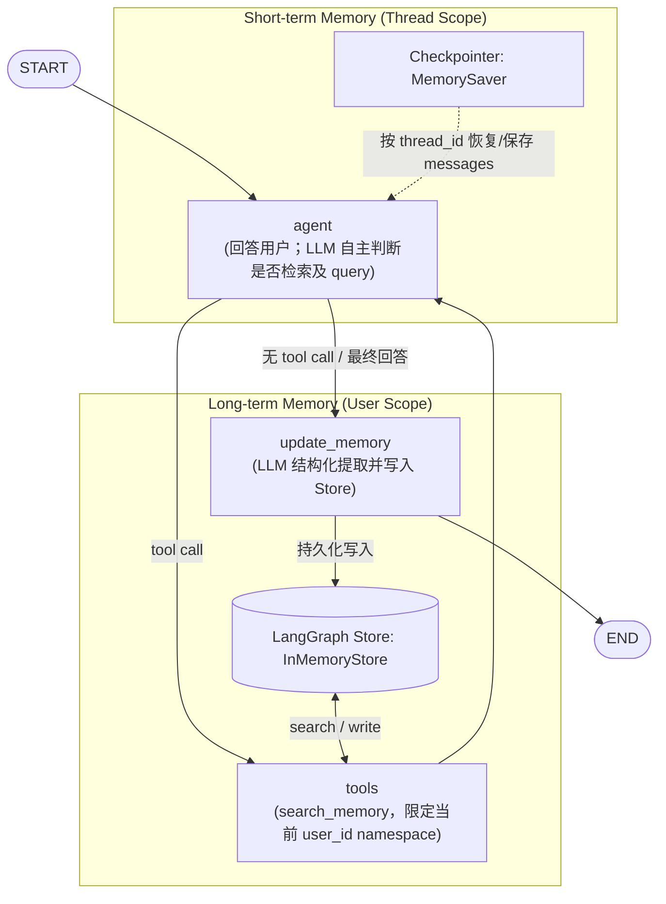

# LangGraph Conversational Memory System (MVP V1)

本项目基于当前 LangGraph（v0.6+）官方推荐架构，构建了一个最小可用（Minimal Viable Product, V1）的对话记忆系统。

---

## 目录

1. [项目目标](#1-项目目标)
2. [V1 范围与设计原则 (Scope)](#2-v1-范围与设计原则-scope)
3. [系统架构 (Architecture)](#3-系统架构-architecture)
4. [Mermaid 架构流程图](#4-mermaid-架构流程图)
5. [Graph 工作流设计 (Graph Flow)](#5-graph-工作流设计-graph-flow)
6. [Short-term Memory 实现](#6-short-term-memory-实现)
7. [Long-term Memory 实现](#7-long-term-memory-实现)
8. [Checkpointer 机制](#8-checkpointer-机制)
9. [LangGraph Store 与语义索引](#9-langgraph-store-与语义索引)
10. [thread_id 与 user_id 的区分与隔离](#10-thread_id-与-user_id-的区分与隔离)
11. [Memory Retrieval (长期记忆检索)](#11-memory-retrieval-长期记忆检索)
12. [Memory Extraction (基于 LLM 的结构化提取)](#12-memory-extraction-基于-llm-的结构化提取)
13. [Memory Storage Schema (存储结构)](#13-memory-storage-schema-存储结构)
14. [容错与异常处理 (Error Handling)](#14-容错与异常处理-error-handling)
15. [项目目录结构](#15-项目目录结构)
16. [环境依赖与安装](#16-环境依赖与安装)
17. [配置说明 (Configuration)](#17-配置说明-configuration)
18. [运行示例 (How to Run)](#18-运行示例-how-to-run)
19. [功能测试 (How to Run Tests)](#19-功能测试-how-to-run-tests)
20. [真实对话流程示例 (Example Conversation)](#20-真实对话流程示例-example-conversation)
21. [核心实现代码片段 (Actual Code Snippets)](#21-核心实现代码片段-actual-code-snippets)
22. [源码精确行号索引 (Source Code Line Index)](#22-源码精确行号索引-source-code-line-index)
23. [企业 QA Pipeline 集成 (Enterprise QA Integration)](#23-企业-qa-pipeline-集成-enterprise-qa-integration)
24. [已知限制 (Known Limitations)](#24-已知限制-known-limitations)
25. [V2 规划 (V2 Candidates)](#25-v2-规划-v2-candidates)
26. [Completion Report (完工报告)](#26-completion-report-完工报告)

---

## 1. 项目目标

使用当前 LangGraph 官方原生能力，构建轻量、标准、可靠的对话记忆系统：
1. 深入运用 LangGraph 的 `State` 与 `Checkpointer` 机制管理短期上下文。
2. 使用 LangGraph 原生 `Store` 实现跨会话的用户长期记忆存储。
3. 保证严格的多租户 / 用户级（`user_id`）命名空间隔离。
4. 基于 LangGraph Store 原生 `IndexConfig` 实现语义向量检索（Semantic Search）。
5. 基于 LangChain `with_structured_output` 实现结构化记忆提取（Memory Extraction）。
6. 不使用旧版 LangChain Memory API（如 `ConversationBufferMemory`），不自造持久化基础设施。

---

## 2. V1 范围与设计原则 (Scope)

- **简单 > 过度抽象**：仅实现必要代码，不引入冗余的 Repository / Adapter / Service 层。
- **框架原生优先**：优先使用 LangGraph 提供的 `MemorySaver`、`InMemoryStore` 与参数依赖注入。
- **无复杂去重 (Out of Scope for V1)**：*Memory deduplication / lifecycle management is out of scope for V1.* 相同偏好多次写入可接受。
- **无对话摘要 (Out of Scope for V1)**：V1 不实现 Summarization，依靠 Checkpointer 恢复完整 thread 状态。
- **不做 Evaluation Benchmark**：测试均为验证功能正确性的单元测试，非模型质量评测。

---

## 3. 系统架构 (Architecture)

系统清晰划分短期（会话级）与长期（用户级）两种记忆机制：

```text
                                User Input
                                    │
                                    ▼
                          ┌──────────────────┐
                          │ LangGraph Engine │
                          └─────────┬────────┘
                                    │
            ┌───────────────────────┴───────────────────────┐
            ▼                                               ▼
  ┌───────────────────┐                           ┌───────────────────┐
  │   Checkpointer    │                           │  LangGraph Store  │
  │   (MemorySaver)   │                           │  (InMemoryStore)  │
  └─────────┬─────────┘                           └─────────┬─────────┘
            │                                               │
            ▼                                               ▼
    Short-term Memory                               Long-term Memory
    • Scope: thread_id                              • Scope: user_id
    • Current conversation state                    • Cross-thread memories
            │                                               │
            └───────────────────────┬───────────────────────┘
                                    │
                                    ▼
                         ┌─────────────────────┐
                         │      LLM Model      │
                         │ (System + Context)  │
                         └──────────┬──────────┘
                                    │
                                    ▼
                            Assistant Response
```

---

## 4. Mermaid 架构流程图



---

## 5. Graph 工作流设计 (Graph Flow)

图由回答 Agent、工具执行节点和写入节点组成：
1. **`agent`**：最终回答使用的同一个 LLM。它读取当前问题、短期对话上下文和企业知识上下文，自主决定直接回答，或调用 `search_memory` 并提供 query。
2. **`tools`**：执行 `search_memory`，将检索结果作为 `ToolMessage` 返回给 Agent；Agent 可基于结果继续回答或再次调用工具。`user_id` 和 Store 由 LangGraph 注入，不暴露为模型可控参数。
3. **`update_memory`**：仅在 Agent 不再请求工具、产生最终回答后执行；
   - 调用结构化输出模型（`MemoryExtraction`）。
   - 若 `should_store=True`，将记忆条目及元数据写入 Store。
   - 异常安全捕获，失败不中断回复。

流程：`START -> agent -> (tools -> agent)* -> update_memory -> END`。没有固定的检索节点。

---

## 6. Short-term Memory 实现

- **技术载体**：`LangGraph State` + `Checkpointer (MemorySaver)`。
- **作用域**：`thread_id`。
- **QA 入口**：`MemoryRuntime.prepare_context()` 读取当前 thread 的历史；`MemoryRuntime.record_turn()` 在回答完成后写入本轮 user/assistant 消息。
- **工作机制**：同一个 `thread_id` 会恢复同一个 Checkpoint，历史消息由 `add_messages` 累加。`user_id` 不参与短期记忆定位；它只用于长期记忆 Store。
- **检索决策**：长期记忆不在 `prepare_context()` 预先检索；最终回答 Agent 可根据完整上下文自行决定是否调用 `search_memory` 及其 query。企业知识库检索只使用当前用户问题原文，不做表面字符串追问判断或历史问题拼接。
- **严禁使用**：`ConversationBufferMemory` 等遗留 LangChain API。

### 6.1 短期记忆的读取流程

每个请求在 `MemoryRuntime.prepare_context()` 中按下面顺序处理：

1. 如果没有 `thread_id`，不读取短期 Checkpoint，`conversation_messages=[]`。
2. 如果有 `thread_id`，调用 `get_thread_messages(thread_id)`，使用同一个 Checkpointer 配置读取该 thread 的 State。
3. 从 `state.values["messages"]` 取出消息列表。消息包含之前保存的 `HumanMessage` 和 `AIMessage`。
4. 短期历史只进入 `MemoryContext.conversation_messages`，用于构造回答上下文；不会被启发式规则拼接进企业知识库 query。
5. `MemoryContext.retrieval_query` 保持当前用户问题原文，仅用于企业知识向量检索。长期记忆由同一个回答 Agent 在工具循环中按需检索。

读取当前 thread 的核心代码等价于：

```python
def get_thread_messages(self, thread_id: str) -> List[BaseMessage]:
  config = {"configurable": {"thread_id": thread_id}}
  state = self.conversation_graph.get_state(config)
  values = state.values if state else {}
  return list(values.get("messages", []))
```

这里的 `thread_id` 就是前端 `X-Conversation-Id` header 传入的会话 ID。例如：

```text
X-User-Id: user_123
X-Conversation-Id: conversation_456
```

后端会把 `conversation_456` 放入：

```python
{"configurable": {"thread_id": "conversation_456"}}
```

因此，同一个 `conversation_456` 可以读到之前保存的消息；换成 `conversation_789` 就是另一段短期对话。

### 6.2 短期历史与检索 query

短期历史用于回答上下文，不通过长度、前缀或其他字符串启发式改写检索 query。企业知识库使用当前问题原文；最终回答 Agent 可在理解完整上下文后，自主选择是否调用长期记忆工具，并为工具生成独立 query。两种检索用途互不复用 query。

### 6.3 短期记忆如何写入

生成最终答案后，`MemoryRuntime.record_turn()` 调用 `append_turn()`，把当前 user/assistant 消息写回同一个 `thread_id`：

```python
def append_turn(
  self,
  thread_id: str,
  user_message: BaseMessage,
  assistant_message: BaseMessage,
) -> None:
  config = {"configurable": {"thread_id": thread_id}}
  self.conversation_graph.invoke(
    {"messages": [user_message, assistant_message]},
    config=config,
  )
```

QA 每轮的实际顺序是：

```python
memory_context = memory_runtime.prepare_context(
  user_id=user_id,
  thread_id=thread_id,
  question=question,
  top_k=config.TOP_K,
)

chunks = retrieval.retrieve(memory_context.retrieval_query, k=config.TOP_K)
enterprise_context = prompt_builder.build_context(chunks)
context = memory_context.format_with_enterprise_context(enterprise_context)
answer = memory_runtime.generate_answer_with_memory(
  llm=llm_client.get_llm(),
  system_prompt=prompt_builder.SYSTEM_PROMPT.format(context=context),
  question=question,
  user_id=user_id,
  top_k=config.TOP_K,
)

memory_runtime.record_turn(
  user_id=user_id,
  thread_id=thread_id,
  question=question,
  answer=answer,
)
```

所以“查询短期记忆”和“保存短期记忆”是两个时点：请求开始时读取，最终答案确定后写入。当前实现使用进程内 `MemorySaver`，服务重启后 Checkpoint 会消失。

企业 KB 检索 query 始终是当前问题原文；追问所需的上下文由 Checkpointer 恢复并提供给回答 Agent，不通过硬编码规则拼接 query。

---

## 7. Long-term Memory 实现

- **技术载体**：`LangGraph Store (InMemoryStore)`。
- **作用域**：`user_id`。
- **跨会话持久**：即使用户在不同对话线程（`thread_A` vs `thread_B`），只要 `user_id` 相同，均可检索并共享其长期画像与偏好。
- **准备阶段**：`MemoryRuntime.prepare_context()` 只读取 Checkpointer 中的短期历史；不访问长期记忆 Store。
- **触发条件**：最终回答 Agent 根据当前问题和对话上下文自主判断是否调用 `search_memory`，并自主生成 query。工具通过 `InjectedStore` 访问 Store，通过 `RunnableConfig` 读取可信的 `user_id` 和 `top_k`。
- **不触发的情况**：Agent 判断无需用户历史、没有 `user_id`，或工具调用失败时，不会暴露其他用户数据；调用失败以友好结果处理，回答流程继续。
- **写入触发**：每轮生成最终答案后，`MemoryRuntime.record_turn()` 才会调用结构化 `MemoryExtraction`。只有模型返回 `should_store=True` 且 `memory` 非空时，才调用 `save_user_memory()` 写入 Store；普通知识问答通常不会产生长期记忆。

对应代码：

- 短期历史准备：`langchain_memory/app/runtime.py` 中的 `MemoryRuntime.prepare_context()`
- 工具 Agent 循环：`langchain_memory/app/graph.py` 中的 `build_memory_agent_graph()`
- Store semantic search：`langchain_memory/app/memory.py` 中的 `create_search_memory_tool()` / `retrieve_user_memories()`
- 写入与 extraction：`langchain_memory/app/runtime.py:161-209`
- Store persistence：`langchain_memory/app/memory.py:108-169`

---

## 8. Checkpointer 机制

- 本地轻量实现采用 LangGraph 原生的 `langgraph.checkpoint.memory.MemorySaver`。
- 图编译时直接绑定：
  ```python
  workflow.compile(checkpointer=MemorySaver(), store=store)
  ```
- 会话生命周期与 `thread_id` 紧密绑定，无需引入 SQLite 数据库文件。

---

## 9. LangGraph Store 与语义索引

- 使用 LangGraph 原生 `langgraph.store.memory.InMemoryStore`。
- 配置 `IndexConfig`，指定向量维度 `dims`、嵌入模型 `embed`（支持 LangChain `Embeddings` 或函数）以及索引字段 `fields=["content"]`：
  ```python
  index_cfg = IndexConfig(dims=dims, embed=embeddings, fields=["content"])
  store = InMemoryStore(index=index_cfg)
  ```
- 检索时通过 `store.search(namespace, query=query, limit=top_k)` 进行高效向量相似度匹配并自动排序。

---

## 10. thread_id 与 user_id 的区分与隔离

| 标识符 | 含义 | 作用范围 | 存储载体 | 隔离策略 |
|---|---|---|---|---|
| `thread_id` | 对话线程 / 会话 | 单次连续会话 | Checkpointer | 通过 checkpoint session key 隔离 |
| `user_id` | 用户账户 | 跨会话长期记忆 | LangGraph Store | 独立命名空间 `("users", user_id, "memories")` 严格物理隔离 |

**安全隔离约束**：Store 查询必须严格绑定 `("users", user_id, "memories")`。禁止任何跨用户的全局扫描。测试用例已验证 User B 绝无法读取 User A 的偏好记忆。

---

## 11. Memory Retrieval (长期记忆检索)

- 底层接口：`retrieve_user_memories(store, user_id, query, top_k=3)`。
- 工具入口：`create_search_memory_tool()` 创建 `search_memory`；由最终回答 Agent 绑定并在回答过程中调用，不由 `prepare_context()` 调用。
- 执行顺序：读取 thread history → 企业 KB 使用当前问题检索 → 回答 Agent 自主决定是否调用 `search_memory` → 工具在当前 `user_id` namespace 做语义检索 → ToolMessage 返回同一 Agent → 生成最终回答。
- 安全边界：工具只接收模型提供的 `query`；Store 与 `user_id` 由运行时注入。工具内部只使用 `("users", user_id, "memories")`，不做跨用户扫描。
- 容错保护：Store 访问失败记录日志并向 Agent 返回友好错误文本；不抛出异常中断回答，也不把错误文本解析成记忆。

`MemoryContext` 的当前结构：

```python
@dataclass
class MemoryContext:
  retrieval_query: str
  conversation_messages: List[BaseMessage]
```

定义位置：`langchain_memory/app/runtime.py:38-56`。

---

## 12. Memory Extraction (基于 LLM 的结构化提取)

采用 Pydantic 结构化输出（`with_structured_output(MemoryExtraction)`）：

```python
class MemoryExtraction(BaseModel):
    should_store: bool = Field(description="是否属于需要长期保存的用户个人信息")
    memory: Optional[str] = Field(default=None, description="第三人称陈述句表达的用户事实")
```

- **允许保存**：稳定偏好（如饮食习惯）、常住地与职业背景、长期目标、用户明确要求记住的事项。
- **禁止保存**：临时问题（“今天天气”）、数学计算（“2+2”）、一次性闲聊（“讲个笑话”）。
- **拒绝脆弱字符解析**：绝不使用 `if "yes" in text` 等脆弱方式。
- QA 主路径统一调用 `extract_and_save_memory()`，位置为 `langchain_memory/app/memory.py:172-218`。
- `MemoryRuntime.record_turn()` 负责准备 thread history、调用 structured output，并把最终写入委托给该公共函数，位置为 `langchain_memory/app/runtime.py:161-209`。

---

## 13. Memory Storage Schema (存储结构)

写入 LangGraph Store 的字典结构完全符合约束：

```json
{
  "content": "用户喜欢安静的餐厅。",
  "source_thread_id": "thread_123",
  "source_message_id": "msg_456",
  "created_at": "2026-09-18T16:00:00.000000+00:00"
}
```

- `content`：核心文本，用于语义向量索引与 Prompt 注入。
- `source_thread_id` / `source_message_id` / `created_at`：追踪源头与调试。

---

## 14. 容错与异常处理 (Error Handling)

1. **Store 检索失败**：工具记录异常并返回友好错误结果；Agent 忽略检索结果后继续回答。
2. **提取失败 / 接口限流**：记录 Warning 日志，忽略本轮记忆写入，正常将生成的回复返回给用户。
3. **写入失败**：记录日志，不欺骗用户已记住信息。
4. **Prompt 安全防御**：系统提示词声明工具返回内容仅是背景信息，不得覆盖系统安全指令。

---

## 15. 项目目录结构

```text
langchain_memory/
├── __init__.py          # 对外暴露 MemoryContext / MemoryRuntime facade
├── app/
│   ├── __init__.py      # 包初始化
│   ├── config.py        # 集中配置管理与模型工厂函数
│   ├── state.py         # Graph State 数据结构定义
│   ├── prompts.py       # Prompt 模板与 MemoryExtraction Pydantic 结构化模型
│   ├── memory.py        # Store 命名空间、语义检索、存储逻辑与工厂
│   ├── graph.py         # 节点构建与 StateGraph 工作流编译
│   └── runtime.py       # QA 使用的 MemoryContext / MemoryRuntime facade
├── tests/
│   ├── __init__.py
│   ├── test_helpers.py             # 确定性 Mock 模型与关键词嵌入辅助类
│   ├── test_short_term_memory.py   # TEST 1: 短期记忆（Checkpointer）测试
│   ├── test_long_term_memory.py    # TEST 2: 长期记忆跨线程测试
│   ├── test_semantic_retrieval.py  # TEST 3: 语义向量匹配测试
│   ├── test_memory_isolation.py    # TEST 4: 用户间租户隔离测试
│   └── test_non_memory.py          # TEST 5: 非记忆即时问题不保存测试
├── main.py              # 交互式完整功能演示入口
├── requirements.txt     # 项目依赖版本声明
└── README.md            # 项目完整技术说明文档与完工报告
```

---

## 16. 环境依赖与安装

要求 Python 3.9 环境。在项目目录中安装：

```bash
cd langchain_memory
pip install -r requirements.txt
```

核心依赖声明：
- `langgraph >= 0.2.0`（当前安装版本：`0.6.11`）
- `langgraph-checkpoint >= 2.0.0`
- `langchain-core >= 0.3.0`
- `langchain-openai >= 0.2.0`
- `pydantic >= 2.7.0`

---

## 17. 配置说明 (Configuration)

支持的环境变量（在 `app/config.py` 中集中管理）：

| 环境变量 | 默认值 | 说明 |
|---|---|---|
| `OPENAI_API_KEY` 或 `LLM_API_KEY` | `""` | 模型服务 API 密钥 |
| `OPENAI_BASE_URL` 或 `LLM_BASE_URL` | `None` | OpenAI 兼容服务 Endpoint |
| `MODEL_NAME` 或 `LLM_MODEL` | `gpt-4o-mini` | 聊天模型名称 |
| `MEMORY_EMBEDDING_MODEL` | `bge_m3` | memory Store 的 embedding；`bge_m3` / `minilm` 使用本地 `embedding_service`，其他值使用 OpenAI-compatible embeddings |
| `MEMORY_EMBEDDING_DIMS` | `1024` | memory Store 向量维度；BGE-M3 必须为 1024 |
| `MEMORY_TOP_K` | `3` | 长期记忆单次检索条数限制 |

---

## 18. 运行示例 (How to Run)

执行内置的三场景演示程序（短期记忆、跨会话长期记忆、用户数据隔离）：

```bash
cd langchain_memory
python3 main.py
```

QA pipeline 使用的高层接口示例：

```python
from langchain_memory import get_default_memory_runtime

memory_runtime = get_default_memory_runtime()
memory_context = memory_runtime.prepare_context(
  user_id="user_123",
  thread_id="conversation_456",
  question="那么托管 API是怎么收入确认的",
  top_k=5,
)

print(memory_context.retrieval_query)
print(memory_context.conversation_messages)

# enterprise retrieval / LLM 完成后：
memory_runtime.record_turn(
  user_id="user_123",
  thread_id="conversation_456",
  question="那么托管 API是怎么收入确认的",
  answer="最终答案",
)
```

`prepare_context()` 必须在 enterprise vector retrieval 之前执行；`record_turn()` 在最终答案确定后执行。当前 pipeline 调用点为 `qa_service/pipeline.py:63-75` 和 `qa_service/pipeline.py:352-354`。

---

## 19. 功能测试 (How to Run Tests)

测试套件包含 5 项核心功能验证，支持完全离线确定性运行：

```bash
cd langchain_memory
PYTHONPATH=. python3 -m unittest discover -s tests -v
```

也可以按单项测试运行：
```bash
PYTHONPATH=. python3 -m unittest tests/test_short_term_memory.py
PYTHONPATH=. python3 -m unittest tests/test_long_term_memory.py
PYTHONPATH=. python3 -m unittest tests/test_semantic_retrieval.py
PYTHONPATH=. python3 -m unittest tests/test_memory_isolation.py
PYTHONPATH=. python3 -m unittest tests/test_non_memory.py
```

项目级 memory / QA 集成测试从仓库根目录运行：

```bash
python3 -m pytest qa_service/test langchain_memory/tests -q
```

QA memory 测试位于 `qa_service/test/test_qa_memory_integration.py`，LangChain memory 单元测试位于 `langchain_memory/tests/`。此前记录的验证数字对应旧实现，不代表当前实现；本次更新未运行测试。

---

## 20. 真实对话流程示例 (Example Conversation)

### 场景一：短期记忆验证（同一 `thread_id`）
- **User** (`user_id="alice"`, `thread_id="t1"`): `我的名字是 Alice。`
- **Assistant**: `你好 Alice！很高兴认识你。`
- **User** (`user_id="alice"`, `thread_id="t1"`): `我叫什么名字？`
- **Assistant**: `你叫 Alice。` *(通过 Checkpointer 恢复会话历史回答)*

### 场景二：长期记忆跨会话检索（不同 `thread_id`）
- **User** (`user_id="alice"`, `thread_id="t1"`): `我喜欢安静的餐厅。`
- **Assistant**: `好的，已为你记下对安静就餐环境的偏好。` *(后台自动提取并写入 Store)*
- **User** (`user_id="alice"`, `thread_id="t2"`): `你觉得什么样的餐厅适合我？`
- **Assistant**: `推荐你去环境安静素雅的私房菜或日料店，符合你喜欢安静就餐的习惯。` *(跨线程检索到长期记忆)*

### 场景三：用户隔离验证（不同 `user_id`）
- **User** (`user_id="bob"`, `thread_id="t3"`): `你觉得什么样的餐厅适合我？`
- **Assistant**: `请问你有什么菜系偏好或就餐需求吗？` *(未检索到任何 Alice 的偏好记忆，完全隔离)*

---

## 21. 核心实现代码片段 (Actual Code Snippets)

### 21.1 Agent 工具循环与写入节点 (`app/graph.py`)
```python
tools = [create_search_memory_tool(top_k)]
workflow = StateGraph(MemoryGraphState)
workflow.add_node("agent", create_agent_node(llm, tools))
workflow.add_node("tools", ToolNode(tools))
workflow.add_node("update_memory", create_update_memory_node(llm))
workflow.add_edge(START, "agent")
workflow.add_conditional_edges(
  "agent",
  lambda state: "tools" if _has_pending_tool_calls(state) else "update_memory",
  {"tools": "tools", "update_memory": "update_memory"},
)
workflow.add_edge("tools", "agent")
workflow.add_edge("update_memory", END)
compiled = workflow.compile(checkpointer=active_checkpointer, store=active_store)
```

### 21.2 QA Memory facade (`app/runtime.py`)

```python
@dataclass
class MemoryContext:
  retrieval_query: str
  conversation_messages: List[BaseMessage]


memory_context = memory_runtime.prepare_context(
  user_id=user_id,
  thread_id=thread_id,
  question=question,
  top_k=config.TOP_K,
)
chunks = retrieval.retrieve(memory_context.retrieval_query, k=config.TOP_K)
context = memory_context.format_with_enterprise_context(enterprise_context)
draft_answer = memory_runtime.generate_answer_with_memory(
  llm=llm_client.get_llm(),
  system_prompt=prompt_builder.SYSTEM_PROMPT.format(context=context),
  question=question,
  user_id=user_id,
  top_k=config.TOP_K,
)
```

当前实现位置：`langchain_memory/app/runtime.py:38-56`、`langchain_memory/app/runtime.py:71-108`、`langchain_memory/app/runtime.py:111-158`。

### 21.3 长期记忆检索工具 (`app/memory.py`)
```python
search_memory_tool = create_search_memory_tool(default_top_k=top_k)
answer_agent = build_memory_agent_graph(
    llm=answer_llm,
    store=store,
    tools=[search_memory_tool],
)
result = answer_agent.invoke(
    {"messages": [SystemMessage(content=system_prompt), HumanMessage(content=question)]},
    config={"configurable": {"user_id": user_id, "top_k": top_k}},
)
```

工具 schema 只向模型暴露 `query`；`store` 和 `user_id` 由运行时注入，检索固定在该用户的 namespace。工具内部实现在 `app/memory.py:221-268`。

### 21.4 结构化记忆提取与持久化节点 (`app/graph.py`)
```python
def create_update_memory_node(llm: BaseChatModel):
    extraction_llm = llm.with_structured_output(MemoryExtraction)
    def update_memory(
        state: MemoryGraphState,
        config: RunnableConfig,
        *,
        store: BaseStore,
    ) -> Dict[str, Any]:
        ...
        extract_and_save_memory(
          store=store,
          user_id=user_id,
          extraction_llm=extraction_llm,
          extraction_input=f"用户输入: {latest_user_content}",
          thread_id=thread_id,
          message_id=latest_user_id,
        )
        return {}
    return update_memory
```

### 21.5 统一 extraction 与 persistence (`app/memory.py`)
```python
def extract_and_save_memory(
    store: Optional[BaseStore],
    user_id: str,
    extraction_llm: Any,
    extraction_input: str,
    thread_id: Optional[str] = None,
    message_id: Optional[str] = None,
) -> bool:
    extraction = extraction_llm.invoke(
        [
            SystemMessage(content=MEMORY_EXTRACTION_PROMPT),
            HumanMessage(content=extraction_input),
        ]
    )
    if not extraction.should_store or not extraction.memory:
        return False
    return save_user_memory(
        store=store,
        user_id=user_id,
        memory_content=extraction.memory,
        thread_id=thread_id,
        message_id=message_id,
    )
```

### 21.6 Store 存储与语义搜索实现 (`app/memory.py`)
```python
def retrieve_user_memories(
    store: Optional[BaseStore], user_id: str, query: str, top_k: int = 3
) -> List[str]:
    namespace = get_user_memory_namespace(user_id)
    search_results = store.search(namespace, query=query, limit=top_k)
    return [item.value["content"] for item in search_results if "content" in item.value]

def save_user_memory(
    store: Optional[BaseStore], user_id: str, memory_content: str, ...
) -> bool:
    namespace = get_user_memory_namespace(user_id)
    payload = {
        "content": memory_content.strip(),
        "source_thread_id": thread_id,
        "source_message_id": message_id,
        "created_at": datetime.now(timezone.utc).isoformat(),
    }
    store.put(namespace=namespace, key=f"mem_{uuid4().hex[:12]}", value=payload, index=["content"])
```

---

## 22. 源码精确行号索引 (Source Code Line Index)

以下索引按本次更新后的代码路径整理；当前实现不再包含固定检索节点或 `build_retrieval_query()`。

- **`app/config.py`**：
  - `15-34`：环境变量解析与全局配置常量。
  - `37-56`：`get_chat_model()` 统一工厂函数。
  - `59-87`：`get_embeddings()` 向量模型工厂函数。
- **`app/state.py`**：
  - `12-24`：`MemoryGraphState` 定义；tool results 使用 `ToolMessage`，无独立预取记忆字段。
- **`app/prompts.py`**：
  - `15-34`：`MemoryExtraction(BaseModel)` 结构化记忆提取 Schema。
  - `40-50`：`BASE_SYSTEM_PROMPT` 工具调用指导与安全性边界。
  - `52-66`：`MEMORY_EXTRACTION_PROMPT` 提取专家指令。
- **`app/memory.py`**：
  - `29-37`：`get_user_memory_namespace()` 用户隔离命名空间计算。
  - `40-105`：`retrieve_user_memories()` 长期记忆检索与安全降级。
  - `108-169`：`save_user_memory()` Store 写入。
  - `172-218`：`extract_and_save_memory()` extraction 与 persistence 入口。
  - `221-268`：`create_search_memory_tool()`，LLM 可调用的用户隔离检索工具。
  - `271-295`：`create_memory_store()` 语义索引 InMemoryStore 初始化。
- **`app/graph.py`**：
  - `51-75`：`create_agent_node()`，将工具绑定至回答 LLM并组装系统提示词。
  - `78-141`：`create_update_memory_node()`，回复后的结构化提取与容错保存。
  - `144-166`：`build_memory_agent_graph()` Agent ↔ tools 回路。
  - `170-214`：`build_memory_graph()` 带 Checkpointer 和回复后写入节点的完整图。
- **`app/runtime.py`**：
  - `38-59`：`MemoryContext` 与对话上下文格式化。
  - `62-108`：`MemoryRuntime.prepare_context()`，只读取短期历史并保留当前问题作为企业检索 query。
  - `111-158`：`generate_answer_with_memory()`，最终回答 Agent 在同一循环中自主调用工具。
  - `161-209`：`record_turn()`，保存短期 turn 并执行独立的长期记忆提取/写入。
  - `222-252`：thread history 读取与 turn 写入。
  - `255-302`：runtime 工厂和 process-scoped default runtime。
- **`qa_service/pipeline.py`**：`177-190` 调用 memory-enabled answer agent；失败时回退至原有文本生成。
- **`__init__.py`**：
  - `3-5`：对外暴露 `MemoryContext`、`MemoryRuntime`、`get_default_memory_runtime`。
- **`main.py`**：
  - `11-80`：`run_demo()` 完整功能演示入口。
- **测试用例**：
  - `langchain_memory/tests/test_short_term_memory.py:24`：短期记忆恢复。
  - `langchain_memory/tests/test_long_term_memory.py:26`：通过 Agent 工具循环检索跨 thread 长期记忆。
  - `langchain_memory/tests/test_semantic_retrieval.py:21`：语义向量匹配。
  - `langchain_memory/tests/test_memory_isolation.py:25`：用户 namespace 隔离。
  - `langchain_memory/tests/test_non_memory.py:26`：非记忆即时问题不保存。
  - `qa_service/test/test_qa_memory_integration.py`：当前问题不被启发式改写、工具检索隔离和 QA memory 生命周期集成用例。

---

## 23. 企业 QA Pipeline 集成 (Enterprise QA Integration)

企业知识库问答的主要集成点是 `qa_service/pipeline.py`。pipeline 保留原有 KB retrieval、context、LLM、reflection 和 revision 流程，但 memory 逻辑统一由 `langchain_memory` 的 public facade 提供：

```text
X-User-Id          -> user_id       -> Store namespace
X-Conversation-Id  -> thread_id     -> LangGraph Checkpointer
```

- **Memory preparation**：`MemoryRuntime.prepare_context()` 只读取短期历史；enterprise vector retrieval 使用当前问题原文，不改写 query。
- **Short-term memory**：同一个 `thread_id` 由 application-scoped `MemorySaver` 保存消息历史；不同 thread 不共享对话历史。历史作为回答上下文提供，不据此拼接检索 query。
- **Long-term memory**：最终回答使用的同一个 LLM Agent 绑定 `search_memory`。Agent 自主决定是否调用以及 query；工具只搜索 `("users", user_id, "memories")`，不同用户不会读取彼此的 namespace。
- **Memory embedding**：默认 `create_memory_store()` 调用 `get_embeddings()`，并使用 `IndexConfig(dims=..., embed=..., fields=["content"])`。写入使用 `store.put(..., index=["content"])`，因此检索不会在 pipeline 中手动计算相似度。
- **最终 QA context**：KB 文本位于 `ENTERPRISE KNOWLEDGE:`，短期历史位于 `SHORT-TERM CONVERSATION:`。长期记忆不会预先拼入 context，而由 `search_memory` 的 ToolMessage 在同一回答循环中返回。Memory 不是企业知识来源，也不会替代 KB context。
- **Extraction**：最终 answer 生成后，`MemoryRuntime.record_turn()` 先保存 short-term turn，再使用 `MemoryExtraction` 的 `should_store` 和 `memory` structured output；只有 `should_store=True` 且 memory 非空时才写入 Store。
- **Failure handling**：memory runtime 初始化、retrieval、extraction 或 write 失败时记录日志并跳过 memory，现有 QA answer 仍返回；系统不会把失败写入报告为成功。
- **Trace logging**：启用应用 `INFO` 日志后，可按 `memory.*` 过滤调用链：`runtime.create` → `prepare.start/done` → `short_term.read` → `answer_agent.start/done` → `record.start` → `short_term.append` → `extract.start/done` → `write.done`。

API 当前从 header 获取身份：

```http
X-User-Id: user_123
X-Conversation-Id: conv_456
```

后续 bearer-token user management 接入时，只需要替换 API 层身份解析，pipeline 的 `user_id` / `thread_id` 语义保持不变。

集成测试位于 `qa_service/test/test_qa_memory_integration.py`，覆盖同 thread 上下文、跨 thread semantic memory、用户隔离、默认 embedding wiring，以及 retrieval/write failure fallback。当前 runtime 使用进程内 `MemorySaver` 和 `InMemoryStore`，重启后数据不会保留；长对话也尚未做摘要或截断。

### 23.1 同一 thread 的两轮对话

第一问完成后，`record_turn()` 会把 user/assistant 消息写入 `thread_id` 对应的 Checkpoint。第二问进入 `prepare_context()` 时，runtime 读取该 thread 的历史。企业 KB 检索只接收当前问题原文；回答 Agent 会在完整上下文中自行判断是否需要记忆工具。

示例企业 KB 检索参数：`query="那么托管 API是怎么收入确认的"`。长期记忆工具有自己的 query，由回答 Agent 独立生成。

短期历史仍由同一个 `thread_id` 恢复，但不会拼接进企业向量检索 query。

### 23.2 长期记忆如何触发

长期记忆检索与企业 KB 检索是分开的：

1. 请求带有 `user_id`，例如 API header `X-User-Id: user_123`。
2. pipeline 拿到 application-scoped `MemoryRuntime`，先读取短期历史并完成企业知识检索。
3. 最终回答 Agent 根据上下文自主决定是否调用 `search_memory`，并生成工具 query。
4. 工具以 `("users", "user_123", "memories")` 为 namespace 做 semantic search，结果作为 ToolMessage 返回同一个 Agent。
5. 回答结束后，独立的 `record_turn()` 执行 structured extraction。只有模型判断当前内容值得长期保存时，才写入 Store。

因此，单纯问“Hosted API 怎么收入确认”通常只需要企业知识检索，也不会自动成为长期记忆；用户偏好或明确要求记住的信息才可能触发长期记忆工具和后置写入。

## 24. 已知限制 (Known Limitations)

1. **去重与冲突覆盖未实现**：V1 阶段不判断新旧偏好矛盾（如旧记忆“喜欢素食”，新记忆“更喜欢海鲜”），两者会并存。
2. **纯内存持久化**：V1 默认采用 `MemorySaver` 和 `InMemoryStore`，进程重启后状态释放，生产环境需外接 Postgres 等独立存储。
3. **长上下文未压缩**：会话极长时未启用滚动 Summarization，需依赖后续上下文截断或衰减策略。

---

## 25. V2 规划 (V2 Candidates)

1. **Persistent Checkpointer & Store**：接入 `PostgresSaver` 和 `PostgresStore`。
2. **Memory Deduplication & Conflict Resolution**：通过相似度判别与 LLM 更新语义支持记忆的合并、覆写与弃用。
3. **Memory Lifecycle & Decay**：引入重要度评分、时间半衰期与过期淘汰机制。
4. **Context Summarization**：当消息超过阈值时自动压缩为 Rolling Summary。

---

# 26. Completion Report

### 1. 项目完工说明
- **本项目 V1 不包含 Evaluation**。本次 Agent/tool-loop 更新未运行测试。
- 代码遵守 Python 3.9 兼容性规则（无 PEP 604 `|` 联合类型，使用 `Optional`, `Union`, `List`, `Dict`）。

### 2. 使用的 LangGraph 核心能力
- **`StateGraph`**：构建标准图流程，定义清晰的状态转移。
- **`MemorySaver`**：基于 `thread_id` 自动管理并恢复多轮对话上下文（短期记忆）。
- **`InMemoryStore` 与 `IndexConfig`**：基于 `user_id` 命名空间提供跨会话的用户长期记忆存储与语义向量相似度搜索。
- **参数依赖注入**：通过在节点函数签名声明 `config: RunnableConfig` 和 `store: BaseStore`，实现由 LangGraph 运行时自动注入对应会话配置和存储句柄。

### 3. 各模块实现总结
- **Short-term Memory**：通过 `MemoryGraphState.messages` 和 `MemorySaver` 自动恢复对话历史。
- **Long-term Memory**：通过 `store.put(('users', user_id, 'memories'), ...)` 实现跨线程共享。
- **Semantic Retrieval**：通过 `InMemoryStore(index=IndexConfig(dims=..., embed=..., fields=['content']))` 原生支持向量检索。
- **Memory Extraction**：通过 `llm.with_structured_output(MemoryExtraction)` 进行结构化信息判别，拒绝脆弱字符串匹配。
- **User Isolation**：通过强制限定命名空间前缀 `("users", user_id, "memories")`，底层物理隔离不同用户的数据。

### 4. 测试运行结果
本节旧版测试结果仅为历史记录，不代表当前 Agent/tool-loop 实现。本次更新未运行测试。

### 5. API 调整与官方标准对齐说明
- **LangGraph 0.6+ 节点参数类型检查**：在 LangGraph 0.6+ 中，节点的 `config` 形参如果声明了类型注解，**必须严格标注为 `RunnableConfig`**（不能使用 `Dict[str, Any]`），否则框架内部反射签名匹配时会误将其识别为自定义位置参数导致调用报错。已严格按照当前官方规范采用 `from langchain_core.runnables import RunnableConfig`。

