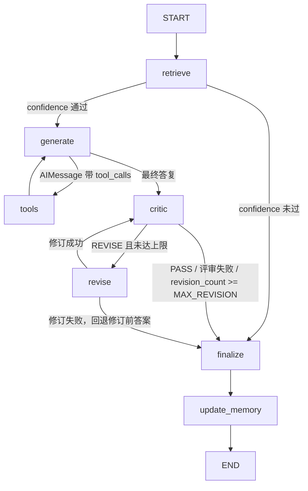

# rag_service

LangGraph 原生编排的 RAG 问答服务，替代 `qa_service` 的手写 pipeline
（`qa_service` 保留不动，本模块完全独立，不 import `qa_service` 与已废弃的
`langchain_memory`）。

## 图结构（节点 + 边）



| 节点 | 实现 | 职责 |
| --- | --- | --- |
| `retrieve` | `graph.retrieve_node` | 向量检索 + 置信度判断 + 企业 context 组装；分配 turn_id，重置循环计数 |
| `generate` | `graph.create_generate_node` | agent 节点，仅挂 `search_memory` 工具；system prompt 用 state 中的 context 现渲染，不写入 messages |
| `tools` | `langgraph.prebuilt.ToolNode` | 执行工具调用，ToolMessage 回到 messages |
| `critic` | `reflection.critic_node` | 原 `qa_service.reflection.reflect()` 的节点化；写入 `is_satisfactory` |
| `revise` | `revision.revise_node` | 原 `qa_service.revision.revise()` 的节点化；失败时 `current_answer` 不动（回退 draft） |
| `finalize` | `graph.finalize_node` | 收敛 `final_answer`/`sources`；修订发生时把最终答复追加为 AIMessage |
| `update_memory` | `langchain_agent.app.graph.create_update_memory_node` | 长期记忆结构化抽取写入（无 user_id 时跳过） |

条件边：`route_after_retrieve` / `route_after_generate` /
`route_after_critic`（含 `MAX_REVISION` 上限，默认 2，`RAG_MAX_REVISION`
可调）/ `route_after_revise`。

## 记忆层

编译时挂载（`build_rag_graph`）：

```python
workflow.compile(
    checkpointer=MemorySaver(),      # 短期：按 thread_id 自动恢复/保存 messages
    store=create_memory_store(),     # 长期：search_memory 读、update_memory 写
)
```

调用时（`RagRuntime.answer_question`）：

```python
graph.invoke(
    {"messages": [HumanMessage(content=question)], "question": question},
    config={
        "configurable": {"thread_id": thread_id, "user_id": user_id, "top_k": top_k},
        "metadata": {"thread_id": thread_id, "user_id": user_id,
                     "entrypoint": "rag_service.runtime.answer_question"},
        "tags": ["rag_service", "rag-agent"],
        "recursion_limit": config.GRAPH_RECURSION_LIMIT,  # 默认 25，防死循环兜底
    },
)
```

没有 `prepare_context` / `format_with_enterprise_context` / 手写
memory_runtime；`thread_id=None` 时使用一次性 thread（不累积历史）。

## 使用

```python
from rag_service import answer_question

result = answer_question("部署流程是什么？", thread_id="conv-123", user_id="u-1")
# AnswerResult(answer, sources, passed_reflection, trace) —— 契约与 qa_service 相同
```

## 检索层集成（vector_service）

`retrieve_node` 的调用链：`retrieval.retrieve()` →
`embedding_service.get_embedder()`（bge-m3，模块级单例）编码 query →
`vector_service.ChromaStore.query()` 查持久化 collection（默认
`vector_db/okf_chunks_bge_m3`，cosine，HNSW）。rag_service 对语料**只读**；
写入路径只有离线导入，不在图内。

已用真实数据端到端验证（2026-09-30）：collection 58 chunks、向量维度 1024、
query 返回距离升序、字段映射完整。若线上大量返回"未找到"，先查
`QA_CONFIDENCE_THRESHOLD`（默认 0.5）是否过严——例如示例查询的 top distance
约 0.57 会被判为低置信，这是阈值校准问题，不是集成故障。

## 与 qa_service 的行为差异

- reflection/revision 从单次 if/else 变为 critic↔revise 循环（上限
  `MAX_REVISION=2`），修订稿会被 critic 复审。
- 检索未通过的"未找到"答复也会写入对话历史（框架统一管理消息的代价；
  原 pipeline 不写 checkpoint）。
- trace 契约不变（request/short_term_memory/retrieval/confidence/context/
  llm/reflection/revision/final_output/response），多轮 critic/revise 时
  同名步骤按轮次追加。

## 测试

```bash
python -m unittest rag_service.test.test_rag_graph -v                # 图编排（全 mock，快）
python -m unittest rag_service.test.test_retrieval_integration -v    # 真实 vector_db + bge-m3（慢，无库时自动跳过）
```
